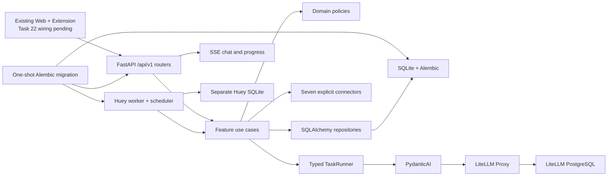

<div align="center">

# 🦀 OpenBiliClaw

**本地优先、证据驱动的跨平台个性化内容发现 Agent**

[English](README_EN.md) · [架构](docs/architecture.md) · [Docker 部署](docs/docker-deployment.md) · [变更记录](docs/changelog.md)

</div>

## 当前状态

OpenBiliClaw 正在进行不兼容的 vNext 后端切换。权威运行时已经是按 feature
拆分的 `/api/v1`、独立 Huey worker、SQLite 应用库、PydanticAI typed tasks 和
LiteLLM Proxy。旧 API、旧数据格式和旧功能 CLI 不再受支持。

现有 static Web 与浏览器扩展仍随 API 挂载，但 **Task 22 完成 API client
重接前不属于可用的 vNext 产品界面**。当前后端验证请使用 OpenAPI、受保护的
API 和运维 CLI；不要依赖静态页面显示的旧设置或旧流程。

保留的核心旅程是：来源连接与 bootstrap → 活动证据 → revisioned profile →
发现 feed → feedback → chat → 本地收藏与稍后观看。内置来源包括 Bilibili、
小红书、抖音、YouTube、X、知乎和 Reddit；每个来源只声明自身真正支持的能力。

## 架构



OpenBiliClaw 只拥有任务语义、输入输出 schema、领域规则和持久化。Provider
凭据、路由、fallback、冷却、网络重试、预算和缓存全部由 LiteLLM 管理。

## 安装

### Docker（推荐）

需要 Docker Compose v2：

```bash
git clone https://github.com/whiteguo233/OpenBiliClaw.git
cd OpenBiliClaw
MODE=docker bash scripts/install.sh
```

安装器以原子方式生成 `.env` 中的 PostgreSQL、LiteLLM、来源加密和 API bearer
secret，权限为 `0600`，重复执行会复用现有值。Compose 先运行一次性 `migrate`
服务，再启动 `api`、`worker`、`litellm` 和 LiteLLM PostgreSQL；migration 失败会
阻止 API/worker 启动。两个长期进程只读检查 schema head，并使用完全相同的应用库
和 Huey queue 路径。

启动后在 `http://127.0.0.1:4000/ui` 配置 provider，并建立三个稳定 alias：

- `obc-interactive`
- `obc-analysis`
- `obc-embedding`

### 源码 / uv

源码安装必须连接用户提供的 LiteLLM。安装器会安全提示 base URL 和 key；key
输入不回显，也不会出现在最终输出中：

```bash
MODE=local bash scripts/install.sh
```

也可在自动化环境预先设置 `OPENBILICLAW_LITELLM_BASE_URL` 与
`OPENBILICLAW_LITELLM_API_KEY`。运行设置写入本地 `.env`，应用数据库写入
`data/vnext/openbiliclaw.db`，queue 写入 `data/vnext/huey.db`。安装顺序固定为：
依赖 → 私密环境 → Alembic migration → API + worker → `doctor` → public 和
bearer-protected readiness。

安装器不会配置 provider 表单，也不会执行产品初始化；来源连接和 onboarding
使用 `/api/v1/sources` 与 `/api/v1/onboarding`。

## 运维 CLI

```text
openbiliclaw serve
openbiliclaw worker
openbiliclaw doctor
openbiliclaw eval
openbiliclaw db migrate
openbiliclaw db backup <destination>
```

API readiness：`GET /api/v1/system/readiness`。除 first-run onboarding 例外外，
业务端点需要 `.env` 中 `OPENBILICLAW_ACCESS_TOKEN` 对应的 bearer token。不要把
token 写入日志、截图或提交到 Git。

## 开发验证

```bash
uv sync --frozen
uv run ruff format --check src tests
uv run ruff check src tests
uv run mypy src
uv run pytest
```

新核心模块要求严格 MyPy、Ruff complexity ≤ 12、import contracts，以及不依赖
真实 provider 的单元测试。历史数据目录保持不动，仅作为手工 archive；vNext
使用新的数据库，不做兼容迁移。

## 文档

- [vNext API](docs/modules/vnext-api.md)
- [vNext AI](docs/modules/vnext-ai.md)
- [vNext sources](docs/modules/vnext-sources.md)
- [Use cases 与 jobs](docs/modules/vnext-use-cases-jobs.md)
- [安装器契约](docs/agent-install.md)
- [手动 E2E](docs/manual-e2e.md)

## License

[MIT](LICENSE)
