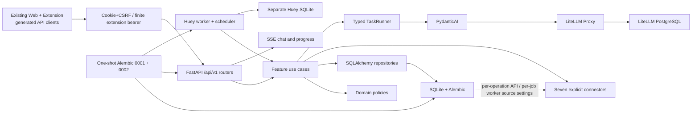

<div align="center">

# 🦀 OpenBiliClaw

**本地优先、证据驱动的跨平台个性化内容发现 Agent**

[English](README_EN.md) · [架构](docs/architecture.md) · [Docker 部署](docs/docker-deployment.md) · [变更记录](docs/changelog.md)

</div>

## 当前状态

OpenBiliClaw 正在进行不兼容的 vNext 后端切换。权威运行时已经是按 feature
拆分的 `/api/v1`、独立 Huey worker、SQLite 应用库、PydanticAI typed tasks 和
LiteLLM Proxy。旧 API、旧数据格式和旧功能 CLI 不再受支持。

现有 static Web 与浏览器扩展已通过由 OpenAPI 确定性生成的 client 接入 vNext。
Web 使用 same-origin HttpOnly cookie + CSRF，扩展使用 device-key 换取有限期 bearer；
两端的 SSE 都通过可带认证的 `fetch` stream 消费。

保留的核心旅程是：来源连接与 bootstrap → 活动证据 → revisioned profile →
发现 feed → feedback → chat → 本地收藏与稍后观看。内置来源包括 Bilibili、
小红书、抖音、YouTube、X、知乎和 Reddit；每个来源只声明自身真正支持的能力。

## 架构



OpenBiliClaw 只拥有任务语义、输入输出 schema、领域规则和持久化。Provider
凭据、路由、fallback、冷却、网络重试、预算和缓存全部由 LiteLLM 管理。
浏览器辅助工作只经权威 `/api/v1/source-tasks` claim/complete 合同；chat 直接经
共享 `TaskRunner` 输出 SSE。Web 与 popup 覆盖 onboarding、来源、证据 profile、feed、
feedback、chat、本地收藏/稍后观看、完整嵌套设置与 LiteLLM alias health；扩展后台通过
同一个 generic source-task claim/complete dispatcher 执行七来源声明的浏览器操作，并把
被动捕获统一归一为 `ActivityEvent`。旧 provider editor、native save/saved sync、delight、
self-update 与 desktop 控件不再进入产品运行图。

## 安装

### Docker（推荐）

需要 Docker Compose v2：

```bash
git clone https://github.com/whiteguo233/OpenBiliClaw.git
cd OpenBiliClaw
MODE=docker bash scripts/install.sh
```

安装器以原子方式生成 `.env` 中的 PostgreSQL、LiteLLM、来源加密、API bearer 和独立
Web/extension session signing secret，权限为 `0600`，重复执行会复用现有值且不会打印。
Compose 先运行一次性 `migrate`
服务，再启动 `api`、`worker`、`litellm` 和 LiteLLM PostgreSQL；migration 失败会
阻止 API/worker 启动。两个长期进程只读检查 schema head，并使用完全相同的应用库
和 Huey queue 路径。安装成功还要求 `migrate` 以 0 退出、API 和 worker 都处于
`healthy`；worker probe 会验证 PID 1、schema head 和 Huey SQLite 可写事务。

启动后在 `http://127.0.0.1:4000/ui` 配置 provider，并建立三个稳定 alias：

- `obc-interactive`
- `obc-analysis`
- `obc-embedding`

### 源码 / uv

源码安装必须连接用户提供的 LiteLLM。安装器会安全提示 base URL 和 key；key
输入不回显，也不会出现在最终输出中：

```bash
MODE=local bash scripts/install.sh
```

也可在自动化环境预先设置 `OPENBILICLAW_LITELLM_BASE_URL` 与
`OPENBILICLAW_LITELLM_API_KEY`。运行设置写入本地 `.env`，应用数据库写入
`data/vnext/openbiliclaw.db`，queue 写入 `data/vnext/huey.db`。安装顺序固定为：
依赖 → 私密环境 → 验明并停止旧 managed pair → Alembic migration → API + worker →
`doctor` → public 和 bearer-protected readiness。源码安装先取得 checkout 根目录下的稳定
跨进程 guard，再读取或初始化内层 lifecycle lock 与 installer metadata；两层共同串行整段
流程，并以完整 installer UUID、canonical root、单调 generation 和 anchor UUID/device/inode
作为同一份 lease。等待结束、进入业务前、generation 更新及退出时都会精确复核两份 lease，
root guard 会校验全部 complete history，并为每代依次 fsync 相同的 pending/committed 两条记录；
只允许修复恰好落后一代且 root/instance/anchor 全相同的 installer 或 process record。
且所有等待共用一个不可重置的截止时间。所有 metadata 替换均保留 held temp FD，在 POSIX
上对该 FD 执行 `fchmod`，再 hard-link no-replace 发布；不会按发布后的 pathname chmod。
POSIX 以 held root/parent FD 逐级打开 `data/vnext`，拒绝 symlink、junction、换 inode 或
多 hard-link anchor。崩溃遗留的未绑定 anchor 仅在 POSIX 上通过普通文件、单链接、owner、
私密 mode 与 pathname identity 检查后原位重绑；native Windows 则在稳定 root guard 内仅
接受 non-reparse、普通文件、单链接且 pathname/held identity 一致的 orphan，不使用 Unix
`fchmod`，也不声称提供 POSIX mode/owner 等价的 ACL 证明。持锁后及退出前都会重读绑定；
已绑定 pathname 缺失或换 inode，以及 symlink/junction ancestor，都会失败关闭；复制 `.env` 后，managed root/DB/Huey/instance 字段会
重绑定当前 checkout，而已有 secret 与外部 LiteLLM connection 保持不变。
停止/失败清理保留 ownership-bound dead state，直到下次 ownership-checked publication；
directory/FIFO 等非普通 state 会失败关闭。Windows log 目录和文件使用不共享 delete、带
`OPEN_REPARSE_POINT` 的 native handle，拒绝 junction/symlink、目录 final 或多链接文件。
Docker 在受保护 readiness 后再次检查 API
与 worker Compose health，避免 probe 期间的 crash-loop 被误报成功。

安全边界是启动时解析并持有的 canonical checkout root。该边界覆盖正常并发、崩溃恢复、
managed leaf 替换和 symlink/junction 重定向；不声称抵御恶意 same-UID 进程替换整个 checkout
root，或在 Windows 上同时替换全部 coordination objects。

安装器不会配置 provider 表单，也不会执行产品初始化；来源连接和 onboarding
使用 `/api/v1/sources` 与 `/api/v1/onboarding`。

## 运维 CLI

```text
openbiliclaw serve
openbiliclaw worker
openbiliclaw doctor
openbiliclaw eval
openbiliclaw db migrate
openbiliclaw db backup <destination>
```

`db backup` 先完成并同步 held payload；macOS 仅使用 `.backup-00.tmp` 至
`.backup-31.tmp` 固定槽并以 exclusive flock 持有，通过 `fclonefileat` 直接从 held FD
原子 no-replace 发布，再核对完整字节与 SQLite integrity。完整成功后只按 held FD 清零并
同步槽供复用；失败的非零槽有界保留，容量耗尽时给出仅可在无 backup 运行时清理的指引。
Linux 保持 unlinked `O_TMPFILE` + `linkat(AT_EMPTY_PATH)`；Linux 在
`AT_EMPTY_PATH` 被 capability policy 拒绝时，仅在验证 `/proc/self/fd` 仍绑定 held inode 后
使用 `AT_SYMLINK_FOLLOW` fallback。Directory sync 后会重查 parent pathname 与 held dir FD，Windows 或缺少
该安全 primitive 的平台会在创建或预留目标前失败关闭。私有 source hard-link staging
目录在验证后也不按 pathname 删除，以免删除并发替换；每个候选 parent 最多保留 32 个，
到达上限后需在确认没有 backup 运行时由运维显式清理 `.obc-backup-source-*`。

API readiness：`GET /api/v1/system/readiness`。除 first-run onboarding 例外外，
业务端点需要 `.env` 中 `OPENBILICLAW_ACCESS_TOKEN` 对应的 bearer token。不要把
token 写入日志、截图或提交到 Git。

## 开发验证

```bash
uv sync --frozen
uv run ruff format --check src tests
uv run ruff check src tests
uv run mypy src
uv run pytest
```

新核心模块要求严格 MyPy、Ruff complexity ≤ 12、import contracts，以及不依赖
真实 provider 的单元测试。历史数据目录保持不动，仅作为手工 archive；vNext
使用新的数据库，不做兼容迁移。

## 文档

- [vNext API](docs/modules/vnext-api.md)
- [vNext AI](docs/modules/vnext-ai.md)
- [vNext sources](docs/modules/vnext-sources.md)
- [Use cases 与 jobs](docs/modules/vnext-use-cases-jobs.md)
- [安装器契约](docs/agent-install.md)
- [手动 E2E](docs/manual-e2e.md)

## License

[MIT](LICENSE)
