<div align="center">

# 🦀 OpenBiliClaw

**通用个性化内容推荐 Agent——本地运行、跨平台理解你、只为你一个人构建**

*A general-purpose personalized content discovery Agent — runs on your machine, understands only you*

[](https://opensource.org/licenses/MIT)
[](https://www.python.org/downloads/)
[](https://github.com/whiteguo233/OpenBiliClaw/releases/latest)
[](https://github.com/whiteguo233/OpenBiliClaw/actions/workflows/ci.yml)
[](https://linux.do/)
[](https://linux.do/t/topic/1978894)
[](https://chromewebstore.google.com/detail/cdfjfkdjjhdaccbldipkjhpibnfbiamg)
[](https://gitee.com/whiteguo233/OpenBiliClaw)

[项目主页](https://whiteguo233.github.io/OpenBiliClaw/) | [English](README_EN.md) | 中文

</div>

## 10 秒看懂 OpenBiliClaw

一个纯本地、私有、开源的自进化跨平台内容发现 Agent：从你的跨平台使用、反馈和对话中持续深化心理画像，带着对你的理解主动去 B 站、小红书、抖音、YouTube、X、知乎、Reddit 等来源找内容。

| 跨平台 | 本地优先 | 可调教 |
|---|---|---|
| B 站 / 小红书 / 抖音 / YouTube / X / 知乎 / Reddit / Web | 数据默认留在本机 SQLite | 喜欢、不感兴趣、聊天反馈都会改变后续推荐 |

<p align="center">
  <a href="https://chromewebstore.google.com/detail/cdfjfkdjjhdaccbldipkjhpibnfbiamg"><b>安装浏览器插件</b></a>
  ·
  <a href="#快速开始"><b>让 AI 助手部署后端</b></a>
</p>

<p align="center">
  <sub>喜欢这个方向？<a href="https://github.com/whiteguo233/OpenBiliClaw">欢迎 Star 支持项目继续适配更多平台</a>。</sub>
</p>

<p align="center">
  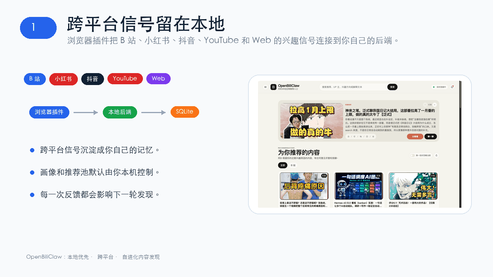
</p>

## 快速开始

普通用户只需四步；Firefox、Docker、脚本和手动部署等备用路径都在 [安装与部署详情](#安装与部署详情)。

1. **装插件** —— [Chrome 应用商店一键安装](https://chromewebstore.google.com/detail/cdfjfkdjjhdaccbldipkjhpibnfbiamg)（自动更新），或从 [Latest Release](https://github.com/whiteguo233/OpenBiliClaw/releases/latest) 下载 zip 手动安装（最新功能先到，商店版可能滞后几天）。
2. **装后端** —— 从同一个 [Latest Release](https://github.com/whiteguo233/OpenBiliClaw/releases/latest) 下载桌面安装包（macOS `.dmg` / Windows `.exe`，开箱即用、常驻菜单栏/托盘）。每个平台有两种安装包:**精简版**(默认,首启自动下载向量模型 bge-m3)与 **`-with-embedding` 完整版**(已内置 bge-m3 ~1.1GB,离线开箱即用)——网络差 / 想离线的选完整版,其余选精简版。想改源码或深度定制,就把下面这句话粘给 Claude Code / Codex CLI / Cursor 等 AI 编程助手：

   ```text
   请按照 https://raw.githubusercontent.com/whiteguo233/OpenBiliClaw/main/docs/agent-install.md 的说明帮我部署 OpenBiliClaw 后端(务必用 Bash 的 curl 下载这个文档,不要用 WebFetch — 会丢关键指令)
   ```

3. **登录平台** —— 在装了插件的浏览器登录 [B 站](https://www.bilibili.com)（默认初始化来源），或改选小红书 / 抖音 / YouTube / X / 知乎 / Reddit 中任意一个已登录平台。
4. **打开界面** —— 浏览器访问 `http://127.0.0.1:8420/web`；手机扫插件二维码打开 `http://<电脑局域网 IP>:8420/m/`，保存到主屏幕即可当 App 用。

## 用户交流群

<table>
  <tr>
    <td align="center" width="50%">
      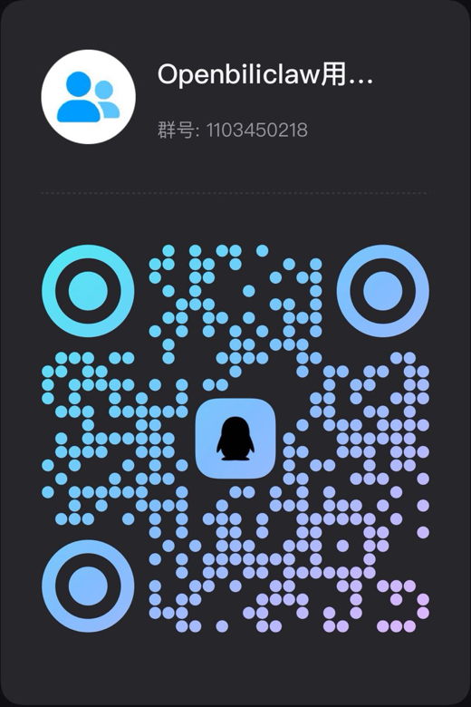<br/>
      <b>QQ 用户群</b>
    </td>
    <td align="center" width="50%">
      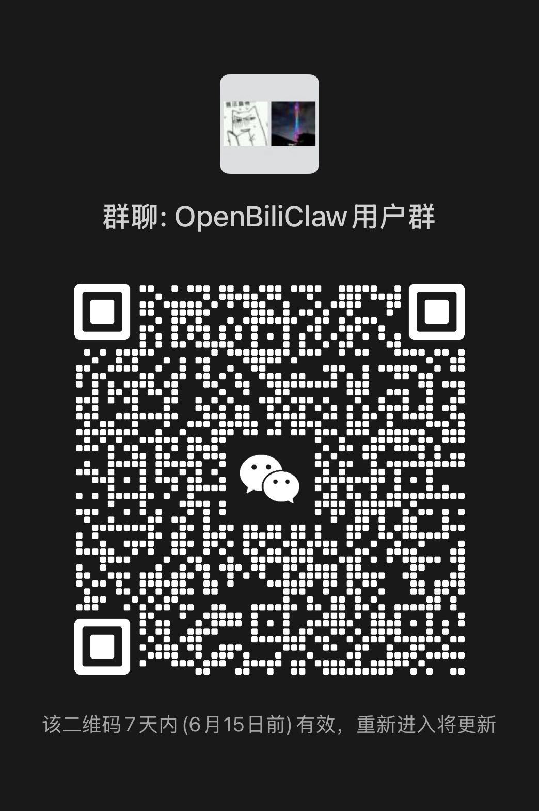<br/>
      <b>微信用户群</b><br/>
      <sub>二维码 7 天内有效，失效后会更新</sub>
    </td>
  </tr>
</table>

## 为什么需要 OpenBiliClaw？

> 名字起源于 B 站（`Bili` = Bilibili，`Claw` = 爪子），项目最早只支持 B 站。从 v0.3.0 起已扩展为通用跨平台 Agent，覆盖 B 站 / 小红书 / 抖音 / YouTube / X / 知乎 / Reddit 与通用 Web，持续接入更多内容平台。

推荐系统本质上是一个**中间商**——平台站在海量内容和海量用户之间做匹配分发。现代推荐系统远比「优化点击率」复杂：它同时权衡点击率、完播率、点赞/投币概率、停留时长、用户留存、创作者生态健康、广告收入等十几个目标，把它们加权压成一个分数来排序。听起来很科学，但问题在于：**这些权重是平台定的，优化目标归根结底是平台的**——用户满意度只是被当作留存和变现的手段，而非目的本身。你以为你在挑内容，其实是中间商在替你决定你能看到什么。结果就是：推荐越来越像你已经看过的东西，偶尔的惊喜全靠运气。

而且每个平台都是一座孤岛。你在 B 站看了三年机械键盘，小红书完全不知道；你在小红书种草的咖啡器具，B 站从来不会推给你。你的兴趣被割裂在不同平台的数据库里，没有人帮你把它们连起来。

**OpenBiliClaw 反过来。** 它是一个本地运行的 AI Agent——先深度理解你，再根据对你的理解**跨平台**主动搜寻你会喜欢的内容。项目从 B 站起步，现已扩展到小红书、抖音、YouTube、X（Twitter）、知乎和 Reddit，后续还会覆盖更多内容平台：

### 🧠 先懂你，再找内容

不是从视频出发匹配标签，而是从你出发。通过行为分析推断 MBTI、认知风格、深层心理需求，构建五层灵魂画像（事件→偏好→觉察→洞察→灵魂）。它理解的是你这个人，不是你的点击记录。

### 🔮 根据理解主动探索，而非被动匹配

这是和传统推荐最核心的差异：系统会基于对你的理解，**主动猜测你可能感兴趣但从未接触过的领域**。一个关注机械表的人可能会喜欢建筑美学，一个看量子物理科普的人可能对哲学感兴趣——它用心理学桥接逻辑主动出击，猜对了升级为正式兴趣，猜错了安静退出。协同过滤永远不会推给你「没人从这条路径走过」的内容，但 OpenBiliClaw 会。

### 🔒 100% 本地，100% 你的

所有数据留在你硬盘上的一个 SQLite 文件里。LLM 默认用你自己的 API Key，也可实验性复用本机 Codex CLI 的 ChatGPT OAuth 凭据。没有云端，没有账号，没有任何人能看到你的画像。这个 Agent 怎么长，完全你说了算——反馈推荐、对话调教、换 LLM、改数据库，随你。

> 💡 **和其他推荐工具的对比**
>
> | | 各平台官方推荐 | 关键词过滤插件 | OpenBiliClaw |
> |---|---|---|---|
> | 推荐逻辑 | 协同过滤 | 标签匹配 | 心理画像 + 五层记忆 |
> | 内容来源 | 单一平台 | 单一平台 | 跨平台（B 站 · 小红书 · 抖音 · YouTube · X · 知乎 · Reddit · 更多） |
> | 信息茧房 | 越推越窄 | 不解决 | 猜测兴趣主动破茧 |
> | 数据归属 | 平台所有 | 通常云端 | 100% 本地 |
> | 推荐解释 | "猜你喜欢" | 无 | 像朋友一样告诉你为什么 |
> | 可定制 | 不可以 | 低 | 换 LLM / 改画像 / 写 Skill |

## 📸 功能预览

核心入口现在有三个：浏览器插件负责平台内交互和登录会话，桌面端 Web（`/web`）提供大屏推荐首页，移动端 Web（`/m`）适合手机使用。桌面端和移动端都只调用本地 API，Cookie 同步和平台任务仍由插件承担。

<table>
  <tr>
    <td align="center" width="25%">
      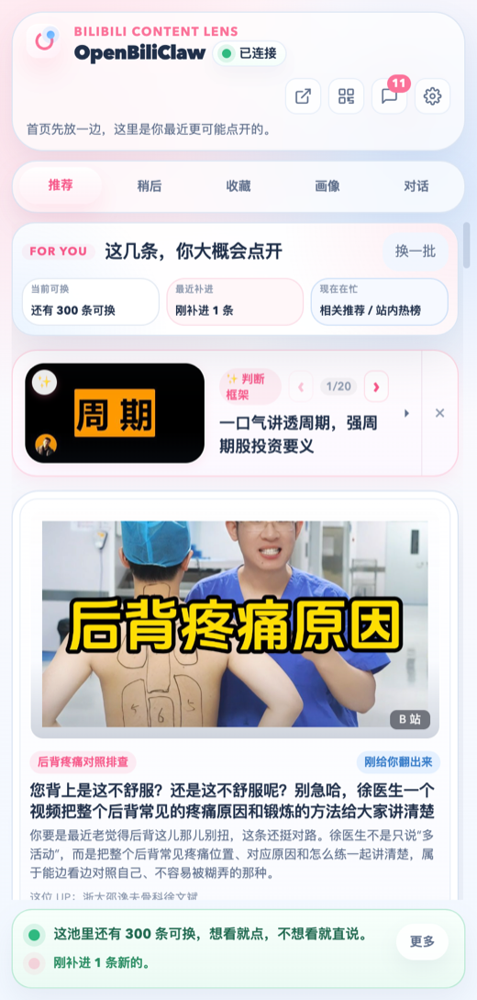<br/>
      <b>智能推荐</b><br/>
      <sub>像朋友一样解释为什么你会喜欢</sub>
    </td>
    <td align="center" width="25%">
      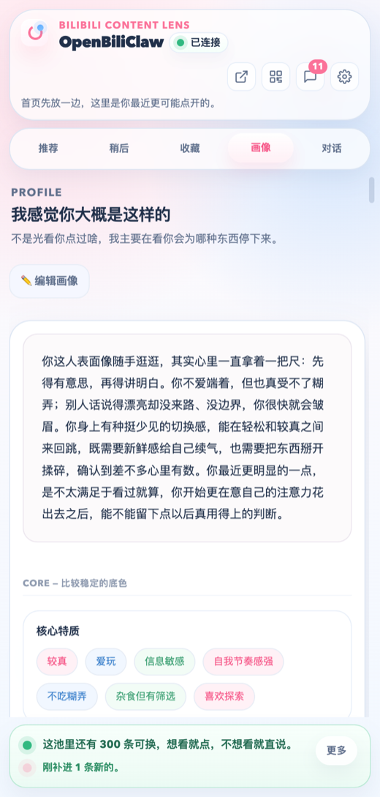<br/>
      <b>灵魂画像</b><br/>
      <sub>自然语言描述的深度人格分析</sub>
    </td>
    <td align="center" width="25%">
      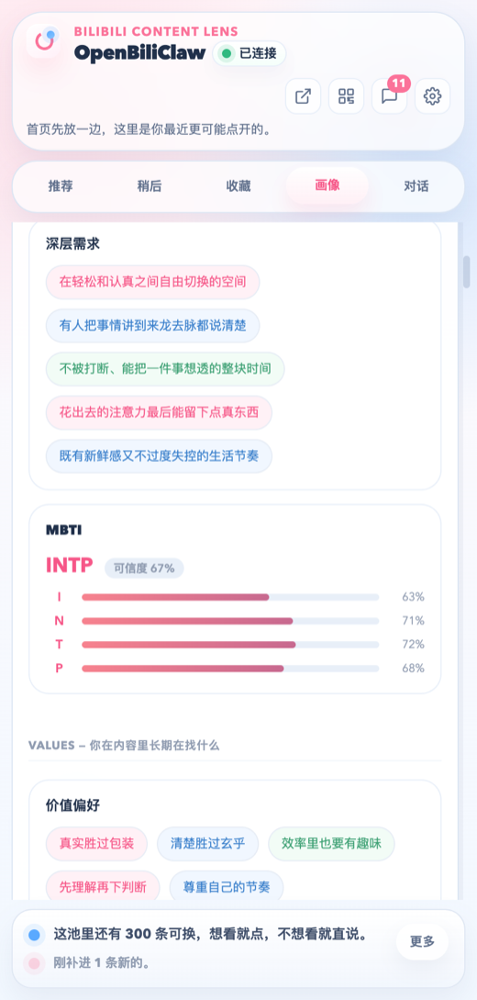<br/>
      <b>结构化特质</b><br/>
      <sub>MBTI · 核心特质 · 深层需求</sub>
    </td>
    <td align="center" width="25%">
      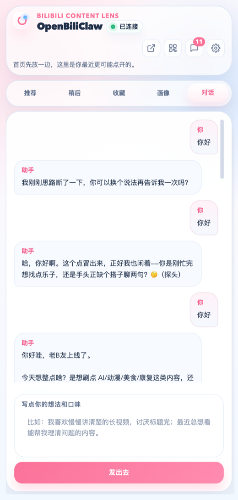<br/>
      <b>对话调教</b><br/>
      <sub>聊天告诉它你想看什么</sub>
    </td>
  </tr>
</table>

### 🖥️ 桌面端 Web 预览

启动后端后访问 `http://127.0.0.1:8420/web`（或直接 `http://127.0.0.1:8420/`，会自动跳转），即可在浏览器大屏上使用推荐首页。

<table>
  <tr>
    <td align="center" width="50%">
      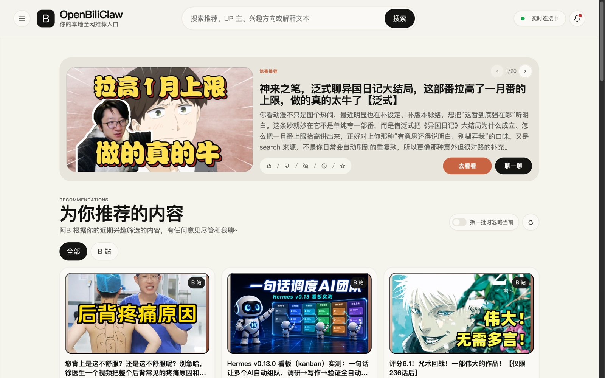<br/>
      <b>桌面推荐首页</b><br/>
      <sub>惊喜推荐 Hero · 为你推荐网格 · 朋友式推荐理由</sub>
    </td>
    <td align="center" width="50%">
      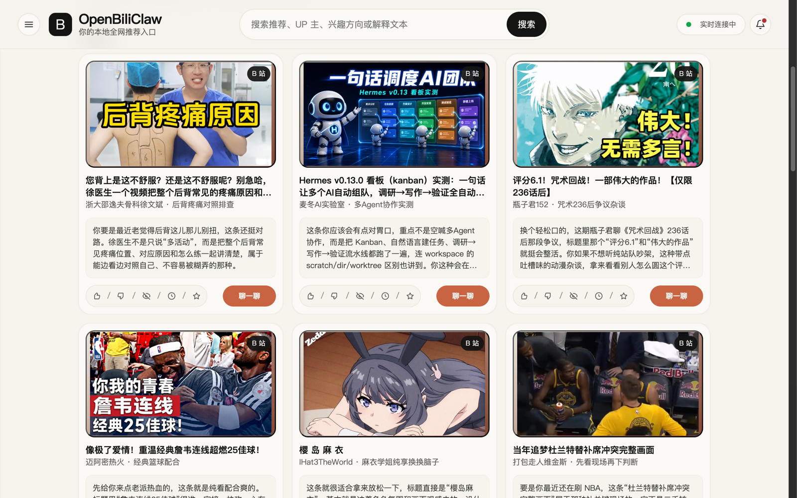<br/>
      <b>推荐卡片网格</b><br/>
      <sub>封面 + 推荐理由 · 喜欢 / 不感兴趣 / 稍后 / 收藏 / 聊一聊</sub>
    </td>
  </tr>
  <tr>
    <td align="center" colspan="2">
      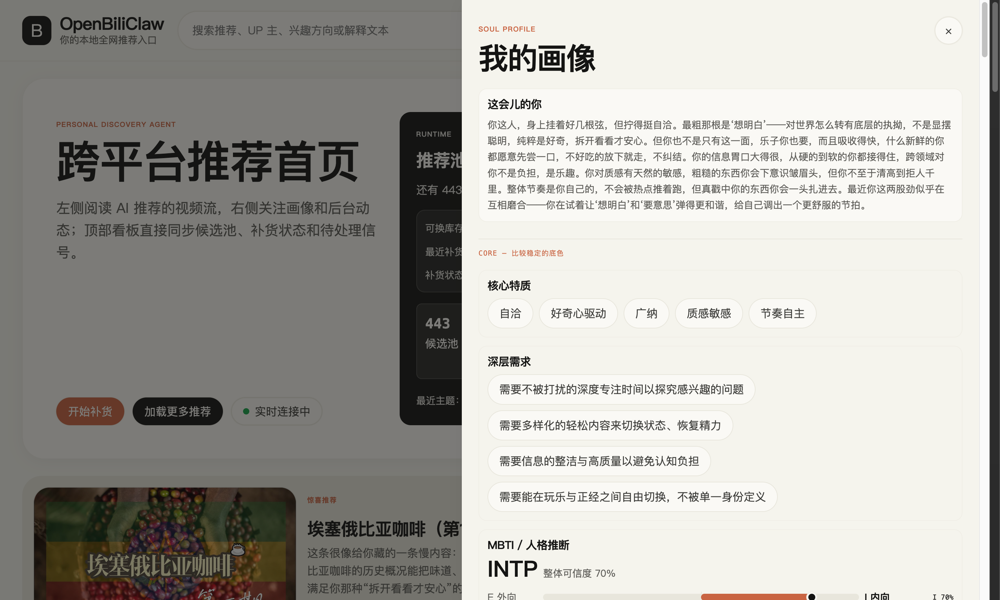<br/>
      <b>画像 + 实时看板</b><br/>
      <sub>侧栏 Runtime 看板 + 后台动态 · 人格素描 · 核心特质 · MBTI 推断</sub>
    </td>
  </tr>
</table>

### 📱 移动端 Web 预览

<table>
  <tr>
    <td align="center" width="33%">
      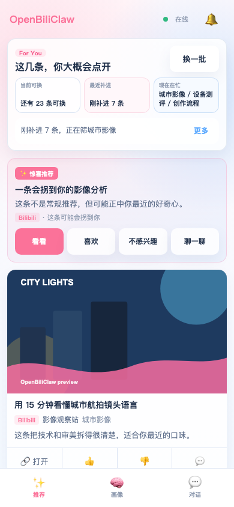<br/>
      <b>手机推荐页</b><br/>
      <sub>惊喜推荐 + 池子状态 · 朋友式推荐原因</sub><br/>
      <sub>看看 / 喜欢 / 稍后 / 收藏 / 不感兴趣 / 聊一聊</sub>
    </td>
    <td align="center" width="33%">
      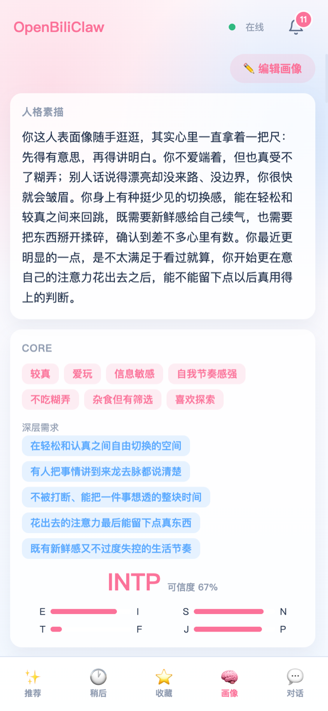<br/>
      <b>手机画像页</b><br/>
      <sub>人格素描 · 核心特质 · 深层需求 · MBTI</sub>
    </td>
    <td align="center" width="33%">
      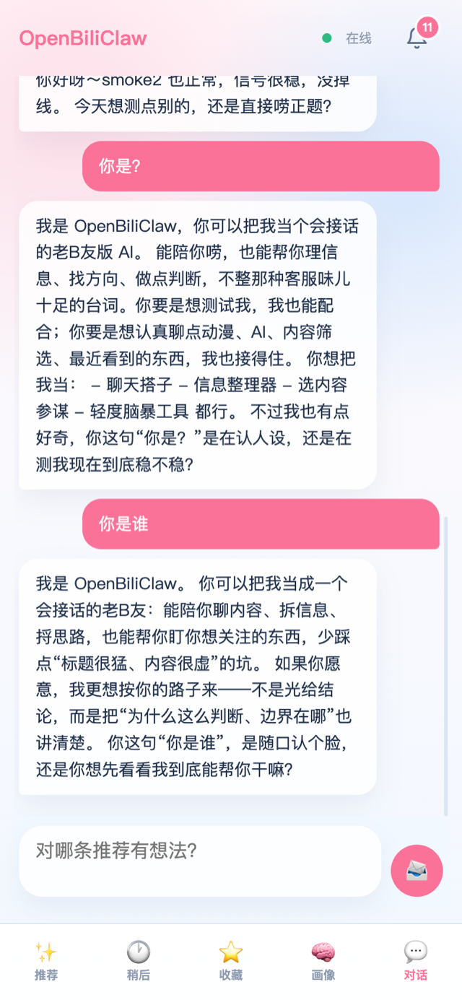<br/>
      <b>手机对话页</b><br/>
      <sub>与插件共享主聊天历史</sub>
    </td>
  </tr>
</table>

<details>
<summary>更多截图</summary>

<table>
  <tr>
    <td align="center" width="33%">
      <br/>
      <b>推荐反馈</b><br/>
      <sub>点赞 / 多来点 / 少来点 / 没兴趣</sub>
    </td>
    <td align="center" width="33%">
      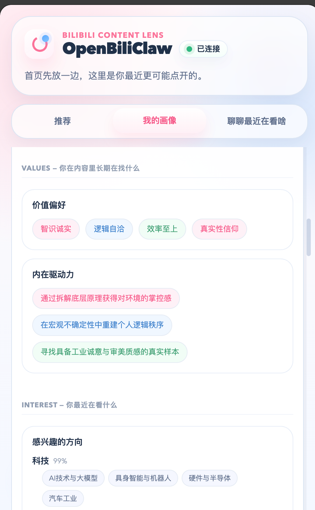<br/>
      <b>价值偏好与兴趣</b><br/>
      <sub>内在驱动力 · 猜测兴趣方向</sub>
    </td>
    <td align="center" width="33%">
      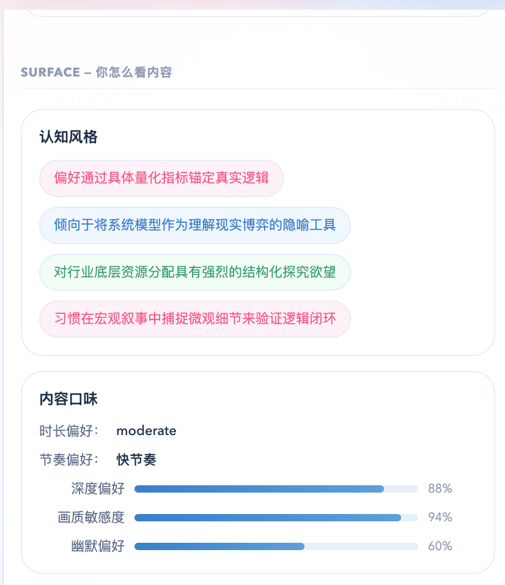<br/>
      <b>认知风格</b><br/>
      <sub>信息处理偏好 · 内容口味</sub>
    </td>
  </tr>
</table>

</details>

## 最近更新

📌 最新版本：**v0.3.161（2026-07-09）**

- **反馈更跟手、可撤销** —— 桌面端推荐卡和兴趣/避雷探针会立即响应，10 秒内可真实撤销；换一批先展示新内容，再在后台记录旧卡。
- **搜索词生成模式可视化** —— 设置页新增「经典 / 混合 / 灵感」下拉，release 包里可直接切换 search-backed keyword inspiration。
- **Keyword inspiration 轴库上线** —— 搜索词生成会复用二级兴趣、真实搜索证据、平台供给优势和历史 yield，产出更具体的平台化关键词。
- **收藏 / 稍后再看本地优先** —— 三端先保存到本地，再由用户手动同步或明确开启默认关闭的自动同步；当前首个真实写入 adapter 为 B 站。

完整变更详见 [docs/changelog.md](docs/changelog.md)。

## 安装与部署详情

普通用户的正常流程是：先安装浏览器插件，再把一句话发给 AI 助手安装后端，在同一个浏览器登录内容平台；如果要在手机上使用，再打开移动端 Web。脚本、Docker 和手动部署只作为备用路径，放在下面折叠区。

### 1. 安装浏览器插件

插件是主要入口：它会在 B 站、小红书、抖音、YouTube、X 和知乎页面显示侧边栏、采集你的反馈，并把知乎 / Reddit 等登录态任务安全地交给本地后端使用。

插件基于 Manifest V3，支持所有兼容 Chrome 插件的浏览器，包括 **Chrome、Edge、Brave、Arc、Vivaldi、Opera** 等。

**推荐方式 · 从 Latest Release 聚合页下载最新版手动安装**（拿到最新功能与修复 —— Chrome 应用商店受审核排期影响，版本通常会滞后几天到一两周）：

1. 打开 [OpenBiliClaw Latest Release](https://github.com/whiteguo233/OpenBiliClaw/releases/latest)，也就是最新 `openbiliclaw-v*` 用户下载聚合页
2. Chrome / Edge / Brave 下载 `openbiliclaw-extension-v*.zip`；Firefox 若 release 提供 `openbiliclaw-extension-v*-firefox.xpi` 就直接安装，否则下载 `openbiliclaw-extension-v*-firefox.zip` 并按下方 `about:debugging` 临时加载
3. 打开扩展管理页面（Chrome：`chrome://extensions/` · Edge：`edge://extensions/` · Brave：`brave://extensions/`），开启右上角「开发者模式」
4. Chrome / Edge / Brave 将下载的 `.zip` 文件拖入页面安装；Firefox 的 `.xpi` 可直接打开确认安装，临时 zip 需要先解压再加载 `manifest.json`

**省事方式 · Chrome 应用商店一键安装**（安装后由浏览器自动更新，适合不想手动升级的人；缺点是版本可能滞后于 Releases）：

> 👉 **[在 Chrome 应用商店安装 OpenBiliClaw](https://chromewebstore.google.com/detail/cdfjfkdjjhdaccbldipkjhpibnfbiamg)** —— 打开后点「添加至 Chrome」即可。

插件更新取决于安装渠道：Chrome Web Store / Edge Add-ons（以及未来 AMO 上架版）由浏览器自动更新；从 GitHub Release 下载的 Chrome zip / Firefox signed XPI / Firefox 临时 zip、开发者模式加载或 Firefox 临时加载的用户，需要下载新版安装包并按同样方式重新加载。后端设置里的“自动更新”开关只更新本地后端源码，不会更新浏览器插件。

<details>
<summary>Firefox 用户：正式安装与临时调试（Firefox 140+）</summary>

Firefox 用 `sidebar_action` 而不是 Chrome 的 `sidePanel`，所以 release 会提供独立产物：

- `openbiliclaw-extension-v*-firefox.xpi`：Mozilla AMO unlisted 签名后的正式安装包；仅在发布环境启用 AMO signing 且凭据可用时生成，普通 Firefox Release / Beta 可以直接安装。
- `openbiliclaw-extension-v*-firefox.zip`：未签名开发包，只用于 `about:debugging` 临时加载或 AMO 签名输入。普通 Firefox 直接安装它会提示“未通过验证 / could not be verified”。

临时调试或源码构建时使用：

```bash
unzip openbiliclaw-extension-v*-firefox.zip -d openbiliclaw-firefox

# 或从源码构建
git clone https://github.com/whiteguo233/OpenBiliClaw.git
cd OpenBiliClaw/extension
npm install
npm run build:firefox          # 产出 dist-firefox/
npm run package:firefox        # 额外打成未签名 openbiliclaw-extension-v*-firefox.zip
# AMO 凭据配置后可签名成正式安装包：
# AMO_JWT_ISSUER=... AMO_JWT_SECRET=... npm run sign:firefox:only
```

加载方式：

1. 打开 `about:debugging#/runtime/this-firefox`
2. 点「Load Temporary Add-on…」
3. 选解压目录里的 `manifest.json`（或源码构建后的 `extension/dist-firefox/manifest.json`）

注意：Firefox 临时加载在浏览器重启后会失效；如果 release 提供已签名 `.xpi`，普通用户应优先使用 `.xpi`。

</details>

### 2. 部署后端（二选一）

普通用户直接用**桌面安装包**最省事；想改源码、换 LLM、深度定制就用 **AI 一句话部署**。

#### 方式 A：下载桌面安装包（实验性，最省事）

到 [Latest Release](https://github.com/whiteguo233/OpenBiliClaw/releases/latest) 的 `openbiliclaw-v*` 聚合发布页下载对应系统的安装包。这个聚合页会同步展示：

- 当前后端源码 tag：`backend-v*`
- 当前插件 release：`extension-v*`，并附 `openbiliclaw-extension-v*.zip` / `openbiliclaw-extension-v*-firefox.zip`（Firefox 临时调试）；启用 AMO signing 时还会附 `openbiliclaw-extension-v*-firefox.xpi`（Firefox 正式安装）
- 当前桌面安装包 release：`desktop-v*`，同版本桌面 channel 完成后会附可用的 `.dmg` / `.exe`；缺失 channel 显示未发布，不回填上一版资产

- **macOS**：从发布页下载与你的 Mac 匹配的 DMG：Apple 芯片用 `OpenBiliClaw-macos-v*-arm64.dmg`；Intel 用 `OpenBiliClaw-macos-v*-x64.dmg`（如发布页提供）。打开后先看 DMG 里的 `首次打开说明 First Launch.html`，再把 OpenBiliClaw 拖进「应用程序」。
- **Windows**：下载 `OpenBiliClaw-windows-*-Setup.exe`，双击安装。

安装包自带本地 Ollama + `bge-m3` embedding，开箱即用；也内置默认内容源依赖，包括 X 的 `twitter-cli` 和 Reddit 的 `rdt-cli`（Reddit rdt 命令后端会优先使用已连接插件同步的 `reddit_session`，插件不可用时可手动运行 `rdt login`，未登录会 fallback 插件）。启动后常驻 **macOS 菜单栏 / Windows 系统托盘**，右键可「打开 Web 界面 / 查看运行日志 / 退出」。数据与 AI / 脚本安装复用同一个目录：`~/OpenBiliClaw`（macOS / Linux）/ `%USERPROFILE%\OpenBiliClaw`（Windows），升级或卸载不会动它；旧安装包曾写入的 `~/Library/Application Support/OpenBiliClaw` / `%LOCALAPPDATA%\OpenBiliClaw` 会在新版本首次启动时非覆盖拷贝回来。若 `config.toml` / `config.local.toml` 损坏导致启动失败，桌面包会把坏文件备份为 `*.invalid` 并重新生成默认配置，随后打开 `/setup/` 重新初始化；`data/` 不会被删除。

> ⚠️ **macOS 安全阻挡（应用尚未签名 / 公证）**：
> - 当前 Release 是 ad-hoc signed、未 notarized。首次打开如果提示“无法验证开发者”或“未经安全验证”，先把应用拖进「应用程序」，再右键 / Control-click `OpenBiliClaw.app` →「打开」→ 在弹窗里再点「打开」；也可以到「系统设置 → 隐私与安全性」点击「仍要打开」。
> - 如果提示“`OpenBiliClaw.app` 已损坏，无法打开。您应该将它移到废纸篓”，通常是下载隔离属性导致。确认包来自本项目 Releases 后运行：
>
>   ```bash
>   APP="/Applications/OpenBiliClaw.app"
>   xattr -dr com.apple.quarantine "$APP"
>   ```
>
>   然后再次打开应用。
> - **Windows**：SmartScreen 弹窗点「更多信息 → 仍要运行」。
>
> 这是**实验性预发布**：未签名、随后端版本滚动更新，适合只想最快试用、不碰命令行的人。要二次开发 / 改源码请用下面的方式 B。

#### 方式 B：AI 一句话部署（可定制 / 可改源码）

把下面整句粘给 Claude Code、Codex CLI、Cursor、Windsurf 或其他 AI 编程助手即可。括号里的限制是给 AI 助手看的，你不用理解。

```text
请按照 https://raw.githubusercontent.com/whiteguo233/OpenBiliClaw/main/docs/agent-install.md 的说明帮我部署 OpenBiliClaw 后端(务必用 Bash 的 curl 下载这个文档,不要用 WebFetch — 会丢关键指令)
```

AI 助手会克隆仓库、安装依赖、用局域网可访问的默认绑定启动后端（`0.0.0.0:8420`）、做健康检查，并问几个有默认值的问题。自动初始化前会真实验证 LLM provider 和 embedding 服务；有一个不通就先停下让你修配置，不会硬跑出空画像。看不懂就选默认；小红书、抖音、YouTube、X 和知乎数据只有你明确同意才会进入初始画像。

Chrome Web Store / AMO 发布包默认只声明本机后端权限。让插件连接局域网另一台机器或远程域名时，在设置里选择协议并填写地址，浏览器会请求该 `scheme://host/*` 的可选权限；WebExtension host permission 无法跨浏览器限定端口，但实际请求仍固定到配置端口。公网地址强制 HTTPS。后端需先用 `ext-key generate` 和 `ext-key enable` 开启默认关闭的设备认证。

### 3. 在同一个浏览器登录内容平台

默认登录 [B 站](https://www.bilibili.com) 并勾选 B 站来源即可生成第一版画像和推荐；如果不想接 B 站，也可以在初始化来源选择里取消它，改勾已登录的 [小红书](https://www.xiaohongshu.com) / [抖音](https://www.douyin.com) / [YouTube](https://www.youtube.com) / [X](https://x.com) / [知乎](https://www.zhihu.com)，勾选会同时开启该来源。至少保留一个来源，且它需要能拉到行为信号。

### 4. 打开桌面端或移动端 Web

后端启动后会同时托管桌面端和移动端 Web，都只调用本地 API，不做 Cookie 同步或平台登录。

```bash
openbiliclaw start
```

- **桌面端**：浏览器直接访问 `http://127.0.0.1:8420/web`（或 `http://127.0.0.1:8420/`，自动跳转）。大屏两栏布局，推荐流、画像、聊天、消息和设置全在一页。
- **移动端**：点击插件顶部的手机图标扫二维码，或手动输入 `http://<电脑局域网 IP>:8420/m/`。适合手机上刷推荐、看画像、和阿B聊天。

> 首次运行 `openbiliclaw init` 时会询问是否允许局域网访问（默认 Y）。如果选了 N 或想改回来，编辑 `config.toml` 的 `[api].host`（`0.0.0.0` = 局域网可达，`127.0.0.1` = 仅本机）。

打开 `/m/` 后可以把手机页面保存成桌面快捷入口：iPhone / iPad 用 Safari 的「分享 → 添加到主屏幕」；Android Chrome / Chromium 浏览器用菜单里的「安装应用」或「添加到主屏幕」。局域网 HTTP 在部分 Android 浏览器上可能只生成快捷方式；如果想要更稳定的完整 PWA 安装提示，建议在可信环境里用 HTTPS 反代访问本机后端。

页面包含「推荐 / 稍后 / 收藏 / 画像 / 对话」五个底部 Tab：推荐页支持「换一批 / 加载更多 / 喜欢 / 不感兴趣 / 稍后再看 / 收藏 / 写一句 / 聊一聊」，稍后和收藏页管理「稍后再看 / 收藏」列表，画像页展示人格素描、核心特质、兴趣和认知更新，对话页与插件共享主聊天历史。

<details>
<summary>不用 AI 助手：直接跑一句话安装脚本</summary>

macOS / Linux / WSL2（Bash）：

```bash
curl -fsSL https://raw.githubusercontent.com/whiteguo233/OpenBiliClaw/main/scripts/install.sh | bash
```

Windows 原生（PowerShell，不需要 Docker / WSL2）：

```powershell
[Net.ServicePointManager]::SecurityProtocol = [Net.ServicePointManager]::SecurityProtocol -bor [Net.SecurityProtocolType]::Tls12; iwr https://raw.githubusercontent.com/whiteguo233/OpenBiliClaw/main/scripts/install.ps1 -UseBasicParsing | iex
```

脚本依赖 `git` 和 Python 3.11+。它会自动克隆仓库，然后先在终端向导里收集 LLM provider、embedding、B 站 Cookie、小红书 opt-in、抖音 opt-in、YouTube opt-in、X opt-in、知乎 opt-in 等决策，再安装依赖、启动后端和健康检查；确认齐全后会先验证 LLM provider 和 embedding 服务都能真实响应，再自动运行 init，完成画像生成和首轮发现。不确定的选项直接回车或选默认。

</details>

<details>
<summary>高级：Docker 部署</summary>

适合已经安装 Docker 的用户，自带 Ollama embedding sidecar。预构建镜像无需克隆源码：

```bash
mkdir -p ~/openbiliclaw && cd ~/openbiliclaw
curl -fsSLO https://raw.githubusercontent.com/whiteguo233/OpenBiliClaw/main/docker-compose.prebuilt.yml
docker compose -f docker-compose.prebuilt.yml up -d
# 然后打开 http://127.0.0.1:8420/setup/ 完成初始化
```

也可以把下面这句粘给 AI 编程助手，走终端向导 + 自动 init：

```text
请按照 https://raw.githubusercontent.com/whiteguo233/OpenBiliClaw/main/docs/docker-deployment.md 的说明帮我用 Docker Compose 部署 OpenBiliClaw 后端(务必用 Bash 的 curl 下载这个文档,不要用 WebFetch)
```

源码构建、升级与排查详见 [Docker 部署指南](docs/docker-deployment.md)。

</details>

<details>
<summary>高级：多源登录与插件链路</summary>

OpenBiliClaw 不保存你的平台密码，也不替你绕过登录。它复用当前浏览器里的登录会话，只抓你自己能看到的内容。

| 源 | 登录方式 | 不登录的影响 |
|---|---|---|
| **B 站** | 在装了插件的浏览器打开 https://www.bilibili.com 正常登录 | 拉不到观看历史 / 收藏 / 关注，画像会明显变弱 |
| **小红书** | 在同一浏览器打开 https://www.xiaohongshu.com 正常登录 | 小红书 discovery 和详情抓取不可用 |
| **抖音** | 在同一浏览器打开 https://www.douyin.com 正常登录 | `init --yes-douyin`、`fetch-douyin` 和 `discover --source douyin` 的 search / hot / feed 可能返回 0 条 |
| **YouTube** | 在同一浏览器打开 https://www.youtube.com 正常登录 | `init --yes-youtube` 和 `fetch-youtube` 可能返回 0 条；仍可用 `import-youtube` 从 Takeout 导入 |
| **X（Twitter）** | 在同一浏览器打开 https://x.com 正常登录 | `init --yes-x`、`fetch-x` 和 X discovery 拉不到数据（服务端重放需要 `auth_token`+`ct0`，登录后扩展自动同步） |
| **知乎** | 在同一浏览器打开 https://www.zhihu.com 正常登录 | `init --yes-zhihu`、`fetch-zhihu`、`discover --source zhihu` 和 `discover-zhihu*` 拉不到数据 |
| **Reddit** | 在同一浏览器打开 https://www.reddit.com 正常登录；插件会同步 `reddit_session` 给日常 discovery 的 rdt-cli，`rdt login` 仅作为插件不可用时的 fallback | `fetch-reddit --mode bootstrap` 拉不到初始化信号；rdt credential 未同步时 rdt 路径会 fallback 到插件任务 |

小红书、抖音、YouTube、知乎走 Chrome 插件任务链路，Reddit 日常 discovery 默认走随后端安装的 rdt-cli、初始化信号仍走插件，X 的 discovery 走服务端 cookie 重放；这些读取链路都不需要你额外启动 CDP 调试 Chrome。Reddit/X、YouTube、小红书、抖音与知乎原生保存 executor 已 6/6 接入并通过 fixture 测试；X/Twitter 首轮真实 favorite 为 `synced`，其余五个平台修复后待新授权验证。`[sources.browser].cdp_url` 只保留给通用 Web / 自定义网页源的浏览器抓取场景。

</details>

<details>
<summary>高级：本地 embedding / Ollama</summary>

如果你不想给 embedding 单独配置 API Key，或担心远程 embedding 配额，可以装一次 Ollama 后使用本地 `bge-m3`：

```bash
# macOS
# 安装并启动官方 Ollama.app（会创建 ollama 命令行入口）
open https://ollama.com/download/mac

# Linux
curl -fsSL https://ollama.com/install.sh | sh && ollama serve &
```

macOS / Windows 用户可以从 [ollama.com/download](https://ollama.com/download) 安装官方 App。启动 Ollama 后运行：

```bash
uv run openbiliclaw setup-embedding
```

向导会自动拉取 `bge-m3`（约 1.1GB，CPU 可跑）并写入配置。

</details>

<details>
<summary>高级：手动安装与 discovery 调试</summary>

> 人类维护者可以参考 [docs/agent-install.md](docs/agent-install.md)(给智能体看的精简契约)和 [docs/agent-deployment.md](docs/agent-deployment.md)(详细排查说明)。

#### 手动安装

```bash
# 克隆项目
git clone https://github.com/whiteguo233/OpenBiliClaw.git
cd OpenBiliClaw

# 使用 uv (推荐)
uv sync

# 或使用 pip
python -m venv .venv
source .venv/bin/activate
pip install -e ".[dev]"
```

#### 手动配置

```bash
# 复制配置模板
cp config.example.toml config.toml

# 编辑配置（设置 LLM API Key 等）
vim config.toml
```

#### 运行

```bash
# 一键初始化（拉取历史 · 生成画像 · 首轮发现）
openbiliclaw init

# 可选：启用本地 Ollama 作为独立 embedding provider（无需额外 API Key）
openbiliclaw setup-embedding

# 手动触发内容发现
openbiliclaw discover

# 可选：抖音内容发现（需先启用 [sources.douyin]；search / hot / feed 从首页 DOM 操作触发）
openbiliclaw discover --source douyin

# 可选：独立调试抖音 search / hot / feed 召回
openbiliclaw discover-douyin --keyword 机械键盘 --source search,feed --no-cache --no-evaluate

# 查看推荐
openbiliclaw recommend

# 查看用户画像
openbiliclaw profile
```

开发者也可以从源码构建插件：

```bash
cd extension
npm install
npm run package
```

</details>

## 🤖 接入 OpenClaw / AI 编码助手

OpenBiliClaw 仓库内置了一个 [workspace skill](skills/openbiliclaw-adapter/SKILL.md)。把仓库挂到任何支持 skill 的 AI 编码助手（OpenClaw / Claude Code / Codex CLI / Cursor 等），助手就能直接调用你本机上的 OpenBiliClaw。

### 接入之后能干什么

- ✨ **主动推荐** — 系统在后台持续发现内容，遇到高分惊喜时通过 WebSocket 主动推送给 OpenClaw，OpenClaw 再转述给你——**你不需要开口问**
- 🔮 **主动追问兴趣** — 系统猜测你可能对某个方向感兴趣，生成一个假设和问题，通过 OpenClaw 主动来问你"这个方向你认不认？"——你回答后画像自动更新
- 🧭 **主动确认避雷** — 系统也会确认你可能想避开的内容形态，OpenClaw 可用 `next-avoidance-probe` / `respond-avoidance-probe` 完成确认；只有确认后才写入过滤偏好
- 💬 **苏格拉底式对话** — 不止是确认兴趣，OpenClaw 可以跟你深聊：追问动机、提出假设、确认理解，越聊越懂你
- 📖 **读当前灵魂画像** — MBTI、核心特质、深层需求、兴趣领域
- 🎯 **按需拉个性化推荐** — 带解释、带置信度、带主题标签
- 💬 **把反馈写回学习闭环** — `like` / `dislike` / `comment` 即时更新画像与池子评分
- 🔄 **同步 B 站账号行为** — 拉历史、收藏、关注等长期信号，注入记忆系统

### 一句话让 OpenClaw 完成接入

把下面这段粘给 OpenClaw（或 Claude Code / Codex CLI / Cursor），它会自动读指南并完成接入：

```text
请按照 https://raw.githubusercontent.com/whiteguo233/OpenBiliClaw/main/docs/openclaw-quickstart.md 的说明帮我把当前仓库接入 OpenClaw(务必用 Bash 的 curl 下载这个文档,不要用 WebFetch — 会丢关键指令)
```

### 用户使用示例

接入后不只是"你问它答"——**系统会主动找你**。以下是两个最核心的场景：

#### 场景一：系统主动推一条惊喜内容

OpenClaw 在后台开着 `listen`，某次 refresh 后系统发现了一条高分内容：

> **OpenClaw**（收到 WebSocket 推送 `delight.candidate`，主动找你）：
>
> > 刚发现一条你可能会意外喜欢的：
> > **《为什么说回县城你也躺不平》** — 县域经济的明斯基时刻。你最近一直在盯地缘政治和宏观债务，这条用硬核推演把土地财政和债务周期的齿轮咬合讲清楚了。`[BV1KMwuzdEcB]`
> >
> > 要不要看看？
>
> **你**："这条非常到位。"
>
> **OpenClaw**（内部执行 `submit-feedback --recommendation-id 4268 --feedback-type like`）

你没有开口要推荐——是系统主动捅过来的。

#### 场景二：系统主动追问你的兴趣

OpenClaw 收到 `interest.probe` 事件（或主动拉取 `next-probe`），发现有一个猜测兴趣假设待确认：

> **OpenClaw**（主动找你）：
>
> > 我从你最近的轨迹里嗅到你可能对【建筑美学】（比如：参数化设计、混凝土美学）感兴趣——你最近看了很多关于结构和空间的内容。这个方向你自己认不认？
>
> **你**："嗯对，最近在看很多参数化设计的东西，安藤忠雄那种清水混凝土的美感很戳我。"
>
> **OpenClaw**（内部执行 `chat --message "嗯对，最近在看很多参数化设计的东西……"`，返回苏格拉底式追问）：
>
> > 你说的这个方向我有个猜测——你是不是其实更在意底层结构而不只是结论？安藤忠雄那种用最少元素构建最大张力的方式，跟你平时看大模型逻辑时追求的"把齿轮咬合讲清楚"好像是同一种审美驱动。你觉得呢？

对话内容自动回写进灵魂画像——下一轮推荐就会把建筑美学纳入正式兴趣，搜索策略也会开始往这个方向发力。

#### 场景三：你也可以主动要推荐

当然，传统的"你问→它答"也完全支持：

> **你**："给我推三条今天值得看的 B 站内容。"
>
> **OpenClaw**（内部执行 `recommend --limit 3`，整理后回复）

整个闭环都是本地的——OpenClaw 只是调 CLI 桥接，画像和数据仍留在你自己的 SQLite 文件里，一条都不会上云。

> 📖 完整命令参考与常见问题，见 [OpenClaw 接入指南](docs/openclaw-quickstart.md)。

## ✨ 核心特性

- 🧠 **五层灵魂画像** — 事件→偏好→觉察→洞察→灵魂，推断 MBTI、认知风格和深层需求（[详解](docs/modules/soul.md)）
- 🔮 **兴趣探针** — 基于心理学桥接主动猜测你可能喜欢的未知领域，猜对升级为正式兴趣，猜错安静退出
- 🧭 **避雷探针** — 主动确认你想避开的内容形态和风格边界，确认后才写入过滤偏好
- 🌐 **跨平台内容源** — B 站 / 小红书 / 抖音 / YouTube / X / 知乎 / Reddit / 通用 Web，兴趣不再被单一平台割裂（[详解](docs/modules/discovery.md)）
- 🎯 **智能多样性** — 主题配额 + 跨平台混排 + 小源保护，告别「一刷都是 AI」
- ⚡ **「换一批」瞬间响应** — reshuffle ~0.6s，连续刷不卡顿
- 💬 **有温度的推荐理由** — 像朋友一样解释为什么你会喜欢，而不是「因为你看过类似视频」
- 🔄 **持续学习** — 苏格拉底式对话 + 行为分析 + 反馈即时生效，越用越懂你
- ⭐ **本地优先收藏 / 稍后看** — 推荐卡先写本地 SQLite；B 站可明确授权后同步原生目标；Reddit/X、YouTube、小红书、抖音与知乎 executor 已 6/6 接入并通过 fixture 测试，X/Twitter 首轮真实 favorite 为 `synced`，其余五个平台修复后待新授权验证
- 🧩 **浏览器插件** — Chrome / Edge / Brave / Arc / Firefox，侧边栏推荐 + 跨站行为采集，装上就能用
- 🚀 **图形化引导初始化** — 安装包 `/setup/`、桌面 Web 和插件都能点一下完成初始化，不碰命令行
- 🔬 **自动化评测优化** — 5 个模块各带 LLM-as-judge 自优化循环，prompt 质量随轮次自动提升
- 🔒 **完全私有** — 所有数据本地 SQLite，LLM 用你自己的 Key，每个实例只为你一个人构建
- 🔌 **本地 embedding** — 可选 Ollama + bge-m3，CPU 即可，无需额外 API Key
- 🔧 **完全可控** — 按模块换 LLM、直接编辑画像、写自定义 Skill 扩展发现策略

## 🏛️ 架构概览

```
┌────────────────────────────────────────────────┐
│          浏览器插件（Chrome / Firefox）           │
│   行为采集 · Cookie 同步 · 平台任务 · 侧边栏推荐     │
└──────────────────────┬─────────────────────────┘
                       │ REST API / WebSocket
                       │ + 桌面 Web (/web) · 移动 Web (/m) · QR LAN-IP
┌──────────────────────▼─────────────────────────┐
│                  Agent 编排层                    │
│ Skill · 对话 · Runtime · 反馈 10s 可撤销提交屏障    │
├─────────┬──────────┬───────────┬───────────────┤
│  Soul   │  Memory  │ Discovery │ Recommendation │
│ 灵魂画像 │ 五层记忆  │多源发现+准入│   推荐与表达     │
├─────────┴──────────┴───────────┴───────────────┤
│ LLM / 多平台源适配 · /api/saved/* · 保存 Router · B 站原生保存 Adapter │
│ 六平台 Adapter → ExtensionNativeSaveBroker → extension_native_save_jobs │
│ 六平台 source task multiplex：xhs / dy / yt / x / zhihu / reddit       │
│ extension_native_save_jobs -> /api/sources/<slug>/next-task -> installed extension │
│ exact OpenBiliClaw / YouTube Watch Later 目标 → 安全 task-result          │
│ trusted-local E2E 精确授权 → 单 item saved sync → 六字段安全 callback      │
│ unsupported_adapter_missing 可重试 · unsupported_content_type local-only │
│ Canonical ID · Local-first SavedSync · Task Poll · SQLite（事件 · 候选池 · 推荐 · 保存/任务）│
│ 六平台 adapter → broker → shared MV3 recovery barrier → Reddit/X/YT/XHS/DY/Zhihu executor（6/6 fixture-only）│
└────────────────────────────────────────────────┘
```

远程扩展连接采用显式、默认关闭的设备认证：`ext-key generate` → 配置仅存摘要 → `/api/auth/extension-token` 换短会话；HTTP 使用 Bearer Header，WebSocket / 图片代理仅携带短会话 query。

> 完整架构细节（runtime 状态机、候选池计数、画像覆盖层等）见 [架构设计](docs/architecture.md) 与 [可视化架构图](docs/index.md#可视化架构图)。

### 内容发现引擎

**多源适配架构**——通过 `SourceAdapter` 协议统一接入不同平台，每个平台有自己的发现方式：

| 来源 | 发现方式 | 取数方式 |
|------|----------|------|
| **B 站** | 搜索 · 趋势 · 关联链 · 跨域探索 | 后端 WBI 签名 API 直连，降级时插件真实搜索页兜底 |
| **小红书** | 被动收集 · 搜索 · 创作者订阅 · 初始化导入 | 插件在已登录页面读取，零后端爬取 |
| **抖音** | 初始化导入 · 搜索 · 热点 · 推荐流 | 插件后台 tab 模拟 DOM 操作，不抢用户焦点 |
| **YouTube** | 初始化导入 · Takeout 离线导入 · 搜索 / 热门 / 频道 | 插件读画像信号，日常发现后端直连补池 |
| **X（Twitter）** | 初始化导入 · 搜索 · For-You · 关注作者 | discovery 使用服务端只读 cookie 重放；原生书签 executor 已接入但未实号验证 |
| **知乎** | 初始化导入 · 搜索 · 热榜 · 推荐 · 作者 · 相关 | 插件在已登录 tab 内读取，返回文字卡片 |
| **Reddit** | 初始化导入 · 搜索 · 热门 · Subreddit · 相关 | discovery 默认 rdt-cli；Saved executor 已接入但未实号验证 |
| **通用 Web** | 浏览器 + LLM 抽取 | 适配任意网页 |

发现之后的统一流程：

- **安全取数** — 后端不代登录、不爬你看不到的内容；所有平台复用你浏览器里已有的登录会话，首轮画像信号只在你点「开始初始化」后按所选来源拉取。
- **统一评估** — 各来源的原始候选写入同一个待评估池，由共享 evaluator 结合灵魂画像、正文和近期负反馈批量打分；「你会不会喜欢」的判断不分散在各平台逻辑里。
- **多样性选择** — 平台配额 → 主题去重 → 风格均衡 → 跨平台混排 → 数量封顶；开箱只启用 B 站，其余平台在设置里显式打开。

> 各平台任务链路、候选池计数、fallback 策略等完整机制见 [内容发现引擎文档](docs/modules/discovery.md)。

### 灵魂引擎

从用户行为中推断：
- **人格画像** — 自然语言描述的用户画像
- **MBTI** — 四维度 + 置信度
- **认知风格** — 信息处理偏好
- **深层需求** — 心理层面的内容驱动力
- **猜测兴趣** — 系统推测的潜在兴趣方向（分子料理、建筑美学、制表工艺...）

## 🏗️ 项目结构

```
OpenBiliClaw/
├── src/openbiliclaw/          # Python 后端核心
│   ├── agent/                 # Agent 编排和 Skill 系统
│   ├── soul/                  # 用户灵魂引擎 (深度画像 · MBTI · 兴趣/避雷探针)
│   ├── memory/                # 多层网状记忆系统
│   ├── discovery/             # 内容发现引擎 (多源策略 · 待评估池 · 配额均分 · 多样性选择)
│   ├── recommendation/        # 推荐与表达引擎 (跨平台混排)
│   ├── sources/               # 多源适配层 (SourceAdapter 协议)
│   │   ├── bilibili_adapter   # B 站 (API 直连)
│   │   ├── xiaohongshu_adapter # 小红书 (扩展代理)
│   │   ├── xhs_tasks          # 小红书插件任务队列 / bootstrap_profile
│   │   ├── dy_tasks           # 抖音插件任务队列 / bootstrap_profile + search + hot + feed
│   │   ├── yt_tasks           # YouTube 插件任务队列 / bootstrap_profile
│   │   ├── zhihu_tasks        # 知乎插件任务队列 / bootstrap_events + search/hot/feed/creator/related
│   │   ├── reddit_tasks       # Reddit bootstrap 插件任务 / extension fallback discovery / rdt 默认 discovery helpers
│   │   └── web_adapter        # 通用 Web (Playwright + LLM)
│   ├── youtube/               # YouTube Takeout 离线导入解析
│   ├── api/                   # 本地 FastAPI (配置回滚 / 降级模式 / popup API)
│   ├── runtime/               # 后台刷新、feedback 合并、presence gate、autostart/Ollama、降级 RuntimeContext
│   ├── bilibili/              # B 站接入层 (WBI 签名 · 速率控制)
│   ├── llm/                   # 多模型 LLM 适配 + 结构化 JSON 容错
│   └── storage/               # 数据存储层
├── extension/                 # Chrome 浏览器插件 (B 站 + 小红书 + 抖音 + YouTube + X + 知乎 + Reddit + 自启动/配置修复)
├── skills/                    # 内置 Skill 定义
├── docs/                      # 项目文档
└── tests/                     # 测试 (1900+)
```

## 🛠️ 技术栈

| 模块 | 技术 |
|------|------|
| 后端 | Python 3.11+ |
| 浏览器插件 | TypeScript + Chrome Extension (Manifest V3) |
| LLM | 内置 Gemini / DeepSeek / OpenAI / Claude / OpenRouter / Ollama；支持任何兼容 OpenAI 协议的服务；OpenAI provider 可实验性复用 Codex CLI OAuth |
| B 站交互 | 自研 API 客户端 (WBI 签名 · v_voucher 自动恢复 · 速率控制) |
| 小红书交互 | 扩展 DOM/state 元数据提取 + 插件任务调度；滚动型初始化会前台打开 `/explore` 并点击页面 profile 入口（零后端爬取） |
| 抖音交互 | 扩展 DOM + MAIN-world 被动 fetch tap + 插件任务调度；初始化导入发布 / 收藏 / 点赞 / 关注信号，search / hot / feed discovery 从抖音首页模拟 DOM 操作触发加载，search/feed 被动收集页面响应 / 渲染结果，hot 可用热榜 `group_id` seed 走已登录页面 related fallback（零后端代登录） |
| YouTube 交互 | 扩展 DOM 任务调度读取观看历史 / 订阅 / 点赞；Google Takeout 可离线导入旧数据 |
| X 交互 | 服务端 cookie 重放（默认安装内置 `twitter-cli`，只读且 lazy import）；扩展捕获你在 x.com 的互动并同步 cookie；推文为纯文本卡片 |
| 知乎交互 | 扩展任务调度在已登录浏览器内读取事件 smoke / 初始化画像信号和 search / hot / feed / creator / related 候选；回答 / 文章 / 问题为纯文本卡片 |
| Reddit 交互 | 默认安装内置 rdt-cli，读取 search / hot / subreddit / related 候选；插件自动同步 `reddit_session` 到 rdt credential，`rdt login` 仅作手动 fallback；rdt 未登录 / 不可用或显式选择 extension 时，扩展任务调度在已登录浏览器内读取 discovery；bootstrap saved/upvoted/subscribed 始终走插件；帖子 / 评论为纯文本卡片 |
| 存储 | SQLite + Embedding 向量索引 |
| 容器化 | Docker Compose (后端) |
| Agent 框架 | 自研轻量框架 |

## 📖 文档

- [文档导航](docs/index.md) — 一站式文档入口
- [常见问题 FAQ](docs/faq.md) — 安装 / 连接 / 更新高频问题速查
- [项目规格说明书](docs/spec.md) — 完整的项目设计与规划
- [架构设计](docs/architecture.md) — 系统架构详解
- [记忆系统设计](docs/memory-design.md) — 多层网状记忆架构
- [内容发现引擎](docs/modules/discovery.md) — 多源发现 + 平台配比 + 多样性选择
- [灵魂引擎](docs/modules/soul.md) — 深度画像 + MBTI + 兴趣猜测
- [CLI 参考](docs/modules/cli.md) · [配置参考](docs/modules/config.md)
- [开发指南](docs/contributing.md) — 如何参与贡献

## 📜 更新日志

最新版本见上方 [最近更新](#最近更新)；完整历史见 [docs/changelog.md](docs/changelog.md)。普通用户从 [Latest Release](https://github.com/whiteguo233/OpenBiliClaw/releases/latest) 的 `openbiliclaw-v*` 聚合页下载插件包和可用桌面安装包；自动化频道 release 仍分别保留 `backend-v*`、`extension-v*`、`desktop-v*`。

## 🗺️ 后续规划

OpenBiliClaw 的目标是做你的**全网个性化内容入口**——从 B 站起步，已覆盖小红书、抖音、YouTube、X、知乎、Reddit 与通用 Web，下一步：

- **更多内容源** — V2EX、微博、各类 BBS / 论坛……每个平台都是一个 `SourceAdapter`，架构已经验证可扩展
- **跨平台兴趣融合** — 你在 B 站看的机械键盘 + 小红书种草的咖啡器具 + 抖音点赞收藏的短视频偏好 + YouTube 长视频观看和订阅 + X 点赞收藏的资讯 = 一个完整的你。画像融合让推荐不再割裂
- **更智能的发现** — 跨平台关联推荐（"你在小红书关注了咖啡器具，B 站有个手冲咖啡纪录片你可能喜欢"，或用抖音 feed 口味补足短视频兴趣）
- **社区生态** — 用户自定义 SourceAdapter、共享发现策略、贡献平台适配器

## 🤝 贡献

欢迎贡献！请查看 [开发指南](docs/contributing.md) 了解如何参与。

## 🙏 致谢

- 感谢 [@addtion99](https://github.com/addtion99) 在 [#8](https://github.com/whiteguo233/OpenBiliClaw/pull/8) 提出浏览器插件后端地址 / 端口可配置需求，并给出 popup 侧实现思路。
- 感谢 [@jiaobenhaimo](https://github.com/jiaobenhaimo) 在 [#53](https://github.com/whiteguo233/OpenBiliClaw/pull/53) 贡献 Safari 扩展、稍后再看、YouTube 搬运检测、营销号过滤等功能设计与实现，其中 OR-join 去重修复和稍后再看功能已合入主线。
- 感谢 [@tangle111-design](https://github.com/tangle111-design) 在 [#69](https://github.com/whiteguo233/OpenBiliClaw/pull/69) 贡献 `style_key` 观看模式、推荐语气、B 站初始化和 LLM / 画像流程方面的功能探索；相关思路已拆分评审并选择性合入主线。

## ⭐ Star History

如果 OpenBiliClaw 帮你找回了对推荐流的控制权，[点个 Star](https://github.com/whiteguo233/OpenBiliClaw) 是对「继续适配更多平台」最直接的投票。

<a href="https://www.star-history.com/?type=date&repos=whiteguo233%2FOpenBiliClaw">
 <picture>
   <source media="(prefers-color-scheme: dark)" srcset="https://api.star-history.com/chart?repos=whiteguo233/OpenBiliClaw&type=date&theme=dark&legend=top-left&sealed_token=1fDGODQkTTYiiU6QJ7F0nashHo3tbMDGZnmqCKDGTGg2P9q1Ukkxv21R3vab-oDvKPMAb5ZCC-hqY_70gspsAqK_gdvCBooa5QSkgwcR-XN3JD1F6vQ03bmVMrjAcMwGn_nqgoZ5TX1OWcv_92lXeBQAfa2Je-bhkYGk8-S0M0R6kOuJuBsXaANiI-am" />
   <source media="(prefers-color-scheme: light)" srcset="https://api.star-history.com/chart?repos=whiteguo233/OpenBiliClaw&type=date&legend=top-left&sealed_token=1fDGODQkTTYiiU6QJ7F0nashHo3tbMDGZnmqCKDGTGg2P9q1Ukkxv21R3vab-oDvKPMAb5ZCC-hqY_70gspsAqK_gdvCBooa5QSkgwcR-XN3JD1F6vQ03bmVMrjAcMwGn_nqgoZ5TX1OWcv_92lXeBQAfa2Je-bhkYGk8-S0M0R6kOuJuBsXaANiI-am" />
   
 </picture>
</a>

## 隐私速览

默认数据流向：浏览器插件 → 你配置的本地 OpenBiliClaw 后端 → 本机 SQLite。插件不会把数据发送到 OpenBiliClaw 开发者运营的服务器。若你配置云端 LLM / embedding，相关内容会按你的配置发送给对应服务商。详见 [隐私政策](docs/privacy.md)。

## 📄 License

[MIT](LICENSE)
