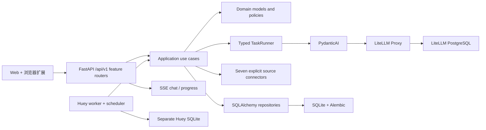

# OpenBiliClaw

**本地优先、证据驱动的跨平台个性化内容发现 Agent**

[English](README_EN.md) · [安装](docs/installation.md) · [架构](docs/architecture.md) · [变更记录](docs/changelog.md)

OpenBiliClaw 将 Bilibili、小红书、抖音、YouTube、X、知乎和 Reddit 的已支持信号归一为证据，持续形成可追溯的用户画像，并据此生成发现 Feed。保留的核心体验包括来源连接与 bootstrap、画像、Feed、反馈、聊天、本地收藏和稍后观看。

v0.4 是不兼容重构：vNext 后端是唯一权威运行时，只支持 `/api/v1` 和 fresh
vNext 数据库，不迁移旧 API 或旧数据。Web 与扩展使用 OpenAPI generated client，
通过 `/api/v1/source-tasks` 执行通用来源任务；TaskRunner 聊天和进度使用认证 SSE。
旧文件不会被修改，可作为手工归档。部署后使用 `openbiliclaw doctor` 检查运行状态。

权威运行时是 FastAPI/Huey vNext 后端；现有 Web 与扩展通过 OpenAPI generated client、
authenticated SSE 和通用 `/api/v1/source-tasks` 接入。运维诊断统一使用
`openbiliclaw doctor`，交互式 AI 统一使用 typed `TaskRunner`。

## 架构



OpenBiliClaw 只拥有任务语义、类型合同、领域规则和产品数据。Provider 凭据、路由、fallback、重试、预算和缓存由 LiteLLM 管理。浏览器任务只走通用 `/api/v1/source-tasks` claim/complete 合同；不支持的来源能力不会被模拟。

## 安装

推荐 Docker Compose v2：

```bash
git clone https://github.com/whiteguo233/OpenBiliClaw.git
cd OpenBiliClaw
MODE=docker bash scripts/install.sh
```

安装完成后：

1. 打开 `http://127.0.0.1:4000/ui`，在 LiteLLM Admin 建立 `obc-interactive`、`obc-analysis`、`obc-embedding` 三个 alias。
2. 打开 `http://127.0.0.1:8420/setup/`，连接来源并运行首次 bootstrap。
3. 在 `http://127.0.0.1:8420/web/` 使用桌面 Web，或构建并加载浏览器扩展。

源码安装要求用户提供 LiteLLM Proxy：

```bash
MODE=local bash scripts/install.sh
```

完整步骤见 [安装指南](docs/installation.md) 和 [Docker 部署](docs/docker-deployment.md)。安装器生成的 secret 写入私密 `.env`，不得提交、粘贴到日志或截图。

## 运维 CLI

```text
openbiliclaw serve
openbiliclaw worker
openbiliclaw doctor
openbiliclaw eval
openbiliclaw db migrate
openbiliclaw db backup <destination>
```

产品工作流只在 Web、扩展和 `/api/v1` 中提供；CLI 不保留旧功能命令。

## 开发验证

```bash
uv sync --frozen
uv run ruff format --check src tests
uv run ruff check src tests
uv run mypy src
uv run lint-imports
uv run pytest --cov=openbiliclaw
```

扩展检查：

```bash
cd extension
npm run api:check
npm run typecheck
npm test
npm run build
npm run build:firefox
```

新核心模块要求严格 MyPy、Ruff complexity ≤ 12、import contracts 和不依赖真实 provider 的测试。

## 文档

- [文档索引](docs/index.md)
- [系统规格](docs/spec.md)
- [平台来源接入](docs/platform-source-integration.md)
- [手动 E2E](docs/manual-e2e.md)
- [架构重构计划](docs/superpowers/plans/2026-07-17-backend-first-architecture-rebuild.md)

## License

[MIT](LICENSE)
