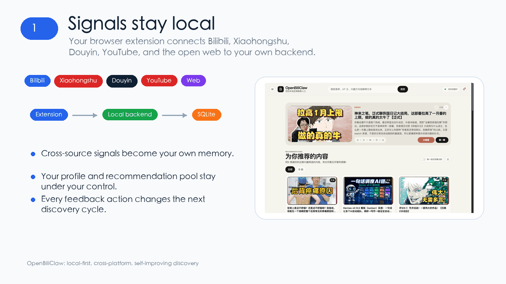

<div align="center">

# 🦀 OpenBiliClaw

**A general-purpose personalized content discovery Agent — runs locally, understands you across platforms, built only for you**

[](https://opensource.org/licenses/MIT)
[](https://www.python.org/downloads/)
[](https://github.com/whiteguo233/OpenBiliClaw/releases/latest)
[](https://github.com/whiteguo233/OpenBiliClaw/actions/workflows/ci.yml)
[](https://linux.do/)
[](https://linux.do/t/topic/1978894)
[](https://chromewebstore.google.com/detail/cdfjfkdjjhdaccbldipkjhpibnfbiamg)
[](https://gitee.com/whiteguo233/OpenBiliClaw)

[Homepage](https://whiteguo233.github.io/OpenBiliClaw/) | English | [中文](README.md)

</div>

## OpenBiliClaw in 10 Seconds

A local-first AI discovery agent that learns your taste across Bilibili, Xiaohongshu (RedNote), Douyin (Chinese TikTok), YouTube, X, Zhihu, Reddit, and the open web — without handing your profile to another platform.

| Cross-platform | Local-first | Trainable |
|---|---|---|
| Bilibili / Xiaohongshu / Douyin / YouTube / X / Zhihu / Reddit / Web | Data stays in your local SQLite by default | Likes, dislikes, and chat feedback shape future recommendations |

<p align="center">
  <a href="https://chromewebstore.google.com/detail/cdfjfkdjjhdaccbldipkjhpibnfbiamg"><b>Install the browser extension</b></a>
  ·
  <a href="#quick-start"><b>Deploy the local backend with an AI coding agent</b></a>
</p>

<p align="center">
  <sub><a href="https://github.com/whiteguo233/OpenBiliClaw">Star the project if you like the direction</a>.</sub>
</p>

<p align="center">
  
</p>

## Quick Start

Four steps for most users. Firefox, Docker, scripted, and manual setup paths all live in [Setup Details](#setup-details).

1. **Install the extension** — one-click from the [Chrome Web Store](https://chromewebstore.google.com/detail/cdfjfkdjjhdaccbldipkjhpibnfbiamg) (auto-updates), or download the zip from [Latest Release](https://github.com/whiteguo233/OpenBiliClaw/releases/latest) for the newest build (the store listing can lag a few days behind).
2. **Install the backend** — grab the desktop installer from the same [Latest Release](https://github.com/whiteguo233/OpenBiliClaw/releases/latest) (macOS `.dmg` / Windows `.exe`, works out of the box, lives in the menu bar / tray). Each platform ships two variants: the **lean** installer (default; downloads the bge-m3 embedding model on first launch) and the **`-with-embedding`** installer (bge-m3 baked in, ~1.1GB, offline-ready) — pick with-embedding for a poor / offline network, lean otherwise. Or, to customize or edit the source, paste this into Claude Code / Codex CLI / Cursor or another AI coding agent:

   ```text
   Please follow https://raw.githubusercontent.com/whiteguo233/OpenBiliClaw/main/docs/agent-install.md to deploy the OpenBiliClaw backend for me (use Bash `curl` to fetch the document, NOT WebFetch — WebFetch summarises markdown and drops critical commands).
   ```

3. **Log in to a platform** — in the same browser as the extension, log in to [Bilibili](https://www.bilibili.com) (default init source), or pick any logged-in platform among Xiaohongshu / Douyin / YouTube / X / Zhihu / Reddit instead.
4. **Open the UI** — visit `http://127.0.0.1:8420/web`, or scan the extension QR code to open `http://<your-LAN-IP>:8420/m/` on your phone and save it to your home screen.

## Why OpenBiliClaw?

> The name comes from Bilibili (`Bili` = Bilibili, `Claw` = "the claw that grabs content for you") — the project started as a Bilibili-only tool. Since v0.3.0 it has evolved into a general cross-platform Agent covering Bilibili / Xiaohongshu / Douyin / YouTube / X / Zhihu / Reddit and the open web, with more platforms on the roadmap.

Recommendation systems are essentially a **middleman** — the platform sits between millions of videos and millions of users, matching and distributing content at scale. Modern systems are far more sophisticated than "just optimizing CTR": they jointly weigh click-through rate, completion rate, like/coin probability, dwell time, user retention, creator ecosystem health, ad revenue, and a dozen other objectives, compressing them into a single weighted ranking score. Sounds scientific, but here's the catch: **the weights are set by the platform, and the optimization targets ultimately serve the platform** — user satisfaction is valued as a means to retention and monetization, not as an end in itself. You think you're choosing content, but really the middleman decides what you get to see. The result: recommendations look more and more like what you've already watched, and the occasional surprise is pure luck.

**OpenBiliClaw is fundamentally different.** It's a locally-running AI Agent that doesn't care what everyone else watches. Instead, it understands **who you are**:

### 🧠 Understands *why* you like things, not just *what* you've watched

It infers your MBTI, cognitive style, and deep psychological needs from your behaviour, building a five-layer soul profile (Event → Preference → Awareness → Insight → Soul). It's not matching video tags — it's understanding you as a person.

### 🔮 Actively breaks your filter bubble

This is the core differentiator: the system **guesses domains you might enjoy but have never explored**. Someone into mechanical watches might love architectural aesthetics; a quantum physics viewer might resonate with philosophy — it uses psychological bridging logic to proactively explore, promotes correct guesses to real interests, and quietly retires wrong ones.

### 🔒 100% local, 100% yours

All data lives in a single SQLite file on your disk. LLM calls use your own API key by default, with an experimental option to reuse local Codex CLI ChatGPT OAuth credentials. No cloud, no accounts, no one else can see your profile. How this Agent grows is entirely your call — send feedback, chat with it, swap LLMs, edit the database, whatever you want.

> 💡 **How it compares**
>
> | | Bilibili Official | Keyword Filter Plugins | OpenBiliClaw |
> |---|---|---|---|
> | Recommendation logic | Collaborative filtering | Tag matching | Psychological profiling + 5-layer memory |
> | Content sources | Single platform | Single platform | Cross-platform: Bilibili · Xiaohongshu · Douyin · YouTube · X · Zhihu · Reddit · more |
> | Filter bubble | Gets narrower | Doesn't address it | Speculative interests actively break it |
> | Data ownership | Platform-owned | Usually cloud | 100% local |
> | Explains why | "Guess you'll like" | None | Friend-like explanations |
> | Customizable | No | Low | Swap LLMs / edit profile / write Skills |

## 📸 Feature Preview

Three core surfaces: the browser extension handles in-page interaction and login sessions, the Desktop Web (`/web`) gives you a big-screen recommendation home, and the Mobile Web (`/m`) is built for phones. Both web surfaces only call your local API — cookie sync and platform tasks still run through the extension.

<table>
  <tr>
    <td align="center" width="25%">
      <br/>
      <b>Smart Recommendations</b><br/>
      <sub>Friend-like explanations of why you'd enjoy it</sub>
    </td>
    <td align="center" width="25%">
      <br/>
      <b>Soul Profile</b><br/>
      <sub>Deep personality analysis in natural language</sub>
    </td>
    <td align="center" width="25%">
      <br/>
      <b>Structured Traits</b><br/>
      <sub>MBTI · core traits · deep needs</sub>
    </td>
    <td align="center" width="25%">
      <br/>
      <b>Chat Tuning</b><br/>
      <sub>Tell it what you want to see</sub>
    </td>
  </tr>
</table>

### 🖥️ Desktop Web Preview

After starting the backend, open `http://127.0.0.1:8420/web` (or just `http://127.0.0.1:8420/`, which redirects automatically) for a full-screen recommendation dashboard.

<table>
  <tr>
    <td align="center" width="50%">
      <br/>
      <b>Desktop Home</b><br/>
      <sub>Delight hero · recommendation grid · friend-like reasons</sub>
    </td>
    <td align="center" width="50%">
      <br/>
      <b>Recommendation Card Grid</b><br/>
      <sub>Cover + reason · like / skip / watch later / favorite / chat</sub>
    </td>
  </tr>
  <tr>
    <td align="center" colspan="2">
      <br/>
      <b>Profile + Live Dashboard</b><br/>
      <sub>Sidebar runtime board + activity · personality sketch · core traits · MBTI</sub>
    </td>
  </tr>
</table>

### 📱 Mobile Web Preview

<table>
  <tr>
    <td align="center" width="33%">
      <br/>
      <b>Recommendations</b><br/>
      <sub>Delight + pool status · friend-like reason</sub><br/>
      <sub>View / like / later / save / not interested / chat</sub>
    </td>
    <td align="center" width="33%">
      <br/>
      <b>Profile</b><br/>
      <sub>Personality sketch · core traits · deep needs · MBTI</sub>
    </td>
    <td align="center" width="33%">
      <br/>
      <b>Chat</b><br/>
      <sub>Shared main chat history with the extension</sub>
    </td>
  </tr>
</table>

<details>
<summary>More screenshots</summary>

<table>
  <tr>
    <td align="center" width="33%">
      <br/>
      <b>Recommendation Feedback</b><br/>
      <sub>Like / more like this / less / not interested</sub>
    </td>
    <td align="center" width="33%">
      <br/>
      <b>Values & Interests</b><br/>
      <sub>Inner drivers · speculative interest directions</sub>
    </td>
    <td align="center" width="33%">
      <br/>
      <b>Cognitive Style</b><br/>
      <sub>Information processing · content taste</sub>
    </td>
  </tr>
</table>

</details>

## Recent Updates

📌 Latest: **v0.3.163 (2026-07-11)**

- **Truthful login status** — PC and Web settings now use only local credentials and extension heartbeats, distinguishing signed-in, unverified, and content-token states without probing platforms.
- **Automatic Web inventory recovery** — bounded retries recover transient recommendation or runtime-status timeouts without replacing cards already being viewed or appended.
- **Cold embedding loads are no longer outages** — local Ollama model warm-up timeouts are separated from real failures while guided init still requires a valid embedding.
- **More accurate preference feedback** — interest and avoidance feedback now applies across fine and broad topics, preserves the real source platform, and uses consistent actions on all three surfaces.

Full changelog: [docs/changelog.md](docs/changelog.md).

## Community

<table>
  <tr>
    <td align="center" width="50%">
      <br/>
      <b>QQ Community</b>
    </td>
    <td align="center" width="50%">
      <br/>
      <b>WeChat Community</b><br/>
      <sub>The QR code is valid for 7 days and will be refreshed after it expires.</sub>
    </td>
  </tr>
</table>

## Setup Details

For most users, setup is four steps: install the extension, ask an AI coding agent to deploy the backend, log in to the content platforms in the same browser, and optionally open the Mobile Web app from your phone.

### 1. Install the browser extension

The extension is the main interface. It shows the sidebar on Bilibili, Xiaohongshu, Douyin, YouTube, X, and Zhihu, records your feedback, and lets the local backend safely reuse browser sessions for logged-in tasks such as Zhihu and Reddit init / discovery.

Built on Manifest V3, the extension works in any Chrome-compatible browser — **Chrome, Edge, Brave, Arc, Vivaldi, Opera**, and more.

**Recommended · download the latest build from the Latest Release aggregate page** (gets the newest features and fixes — the Chrome Web Store listing usually lags by a few days to a couple of weeks due to review scheduling):

1. Open [OpenBiliClaw Latest Release](https://github.com/whiteguo233/OpenBiliClaw/releases/latest), the newest user-facing aggregate `openbiliclaw-v*` release
2. Chrome / Edge / Brave users download `openbiliclaw-extension-v*.zip`; Firefox users install `openbiliclaw-extension-v*-firefox.xpi` when it is present, otherwise download `openbiliclaw-extension-v*-firefox.zip` and load it temporarily through `about:debugging`
3. Open the extensions page (Chrome: `chrome://extensions/` · Edge: `edge://extensions/` · Brave: `brave://extensions/`), enable "Developer mode" in the top right
4. Chrome / Edge / Brave users drag the downloaded `.zip` file into the page to install; Firefox `.xpi` files install directly, while the temporary zip must be unzipped before loading `manifest.json`

**Convenient · one-click from the Chrome Web Store** (the browser keeps it auto-updated — best if you don't want to update manually; downside: the version can lag behind Releases):

> 👉 **[Install OpenBiliClaw on the Chrome Web Store](https://chromewebstore.google.com/detail/cdfjfkdjjhdaccbldipkjhpibnfbiamg)** — click "Add to Chrome".

Extension updates depend on the install channel: Chrome Web Store / Edge Add-ons (and a future listed AMO build) are updated by the browser; GitHub Release Chrome zips / Firefox signed XPIs / Firefox temporary zips, developer-mode loads, and Firefox temporary installs must download the new package and reload it manually. The backend "auto update" switch only updates the local backend source checkout, not the browser extension.

<details>
<summary>Firefox users: regular install and temporary debugging (Firefox 140+)</summary>

Firefox uses `sidebar_action` instead of Chrome's `sidePanel`, so releases ship separate Firefox artifacts:

- `openbiliclaw-extension-v*-firefox.xpi`: signed through Mozilla AMO unlisted signing when AMO signing is enabled and credentials are available, installable directly in regular Firefox Release / Beta.
- `openbiliclaw-extension-v*-firefox.zip`: unsigned development package for `about:debugging` temporary loading or AMO signing input. Installing this zip directly in regular Firefox reports that the add-on could not be verified.

For temporary debugging or source builds:

```bash
unzip openbiliclaw-extension-v*-firefox.zip -d openbiliclaw-firefox

# Or build from source
git clone https://github.com/whiteguo233/OpenBiliClaw.git
cd OpenBiliClaw/extension
npm install
npm run build:firefox          # writes dist-firefox/
npm run package:firefox        # also produces unsigned openbiliclaw-extension-v*-firefox.zip
# With AMO credentials configured, sign it into the installable XPI:
# AMO_JWT_ISSUER=... AMO_JWT_SECRET=... npm run sign:firefox:only
```

Then:

1. Open `about:debugging#/runtime/this-firefox`
2. Click "Load Temporary Add-on…"
3. Pick `manifest.json` from the unzipped directory, or `extension/dist-firefox/manifest.json` after a source build

Caveat: temporary add-ons disappear on Firefox restart; regular users should prefer the signed `.xpi` when the release provides one.

</details>

### 2. Deploy the backend (two options)

Most users: the **desktop installer** is the least effort. Want to edit the source, swap LLMs, or customize deeply? Use the **AI one-line deploy**.

#### Option A: Download the desktop installer (experimental, easiest)

Grab the installer for your OS from the `openbiliclaw-v*` aggregate [Latest Release](https://github.com/whiteguo233/OpenBiliClaw/releases/latest). The aggregate page shows:

- Current backend source tag: `backend-v*`
- Current extension release: `extension-v*`, with `openbiliclaw-extension-v*.zip` / `openbiliclaw-extension-v*-firefox.zip` (Firefox temporary debugging); AMO signing-enabled releases also include `openbiliclaw-extension-v*-firefox.xpi` (regular Firefox install)
- Current desktop installer release: `desktop-v*`, with available `.dmg` / `.exe` assets when the same-version desktop channel has shipped; missing channels are shown as unpublished instead of being backfilled from a previous release

- **macOS**: download the DMG that matches your Mac: `OpenBiliClaw-macos-v*-arm64.dmg` for Apple silicon, or `OpenBiliClaw-macos-v*-x64.dmg` for Intel when the release provides it. Open `首次打开说明 First Launch.html` in the DMG, then drag OpenBiliClaw into Applications.
- **Windows**: download `OpenBiliClaw-windows-*-Setup.exe` — double-click to install.

It bundles local Ollama + `bge-m3` embedding (works out of the box) plus the default source dependencies, including X's `twitter-cli` and Reddit's `rdt-cli` (Reddit's rdt command backend prefers the connected extension's synced `reddit_session`; `rdt login` remains a manual fallback, and unauthenticated runs fall back to extension tasks). It lives in the **macOS menu bar / Windows system tray**; right-click for "Open Web UI / View runtime logs / Quit". Data uses the same directory as the AI / script installers: `~/OpenBiliClaw` (macOS / Linux) / `%USERPROFILE%\OpenBiliClaw` (Windows), and survives upgrades and uninstalls. Data from older packaged builds under `~/Library/Application Support/OpenBiliClaw` / `%LOCALAPPDATA%\OpenBiliClaw` is copied back on first launch without overwriting existing files. If a broken `config.toml` / `config.local.toml` prevents startup, the desktop package backs the bad file up as `*.invalid`, regenerates the default config, then opens `/setup/` so initialization can run again; `data/` is left untouched.

> ⚠️ **macOS security blocking (the app isn't signed / notarized yet)**:
> - The current Release is ad-hoc signed but not notarized. On first launch, if macOS says it cannot verify the developer or the app was not checked for safety, drag it into Applications first, then right-click / Control-click `OpenBiliClaw.app` → "Open" → click "Open" again in the dialog; or allow it under "System Settings → Privacy & Security" with "Open Anyway".
> - If macOS says "`OpenBiliClaw.app` is damaged and can't be opened", it is usually the download quarantine attribute. After confirming the package came from this project's Releases, run:
>
>   ```bash
>   APP="/Applications/OpenBiliClaw.app"
>   xattr -dr com.apple.quarantine "$APP"
>   ```
>
>   Then open the app again.
> - **Windows**: on the SmartScreen prompt, click "More info → Run anyway".
>
> This is an **experimental pre-release**: unsigned, rolling with the backend version, best for trying it fast without the command line. To hack on the source, use Option B.

#### Option B: AI one-line deploy (customizable / editable source)

Paste this whole prompt into Claude Code, Codex CLI, Cursor, Windsurf, or another AI coding agent. The parenthetical note is for the agent; you do not need to understand it.

```text
Please follow https://raw.githubusercontent.com/whiteguo233/OpenBiliClaw/main/docs/agent-install.md to deploy the OpenBiliClaw backend for me (use Bash `curl` to fetch the document, NOT WebFetch — WebFetch summarises markdown and drops critical commands).
```

The agent will clone the repo, install dependencies, start the backend with the LAN-accessible default bind (`0.0.0.0:8420`), run a health check, and ask a few questions with defaults. Before auto-init, it verifies that both the configured LLM provider and embedding service answer real lightweight calls; if either fails, init is blocked until you fix the service. If unsure, pick the default. Xiaohongshu, Douyin, YouTube, X, Zhihu, and Reddit signals are used in the initial profile only when you explicitly opt in.

Chrome Web Store / AMO builds only declare local-backend permissions by default. When you select a protocol and enter another LAN or remote endpoint, the browser requests `scheme://host/*`; WebExtension host permissions cannot be port-scoped across browsers, while actual requests remain pinned to the configured port. Public hosts require HTTPS. Enable the default-off device flow first with `ext-key generate` and `ext-key enable`.

### 3. Log in to content platforms in the same browser

By default, log in to [Bilibili](https://www.bilibili.com) and keep Bilibili selected to build the first profile and recommendations. If you do not want Bilibili, deselect it during init and select another logged-in source such as [Xiaohongshu](https://www.xiaohongshu.com), [Douyin](https://www.douyin.com), [YouTube](https://www.youtube.com), [X](https://x.com), or [Zhihu](https://www.zhihu.com); selecting it enables that source. Keep at least one source selected, and it must return behavioral signals.

### 4. Open Desktop or Mobile Web

The backend serves both a desktop and a mobile Web UI. Neither syncs cookies or crawls pages — they only call your local API.

```bash
openbiliclaw start
```

- **Desktop**: open `http://127.0.0.1:8420/web` (or `http://127.0.0.1:8420/`, auto-redirects). Two-column editorial layout with recommendations, profile, chat, messages, and settings all on one page.
- **Mobile**: click the phone icon in the extension header to scan the QR code, or type `http://<your-LAN-IP>:8420/m/` manually. Best for browsing recommendations, profile, and chat on your phone.

> During `openbiliclaw init`, you'll be asked whether to allow LAN access (default Y). If you chose N or want to change it later, edit `[api].host` in `config.toml` (`0.0.0.0` = LAN-reachable, `127.0.0.1` = local only).

After opening `/m/`, save it as a home-screen shortcut: on iPhone / iPad, use Safari's Share menu and choose "Add to Home Screen"; on Android Chrome / Chromium browsers, use the menu item "Install app" or "Add to Home screen". LAN HTTP may only create a shortcut in some Android browsers; full PWA install prompts are more reliable behind HTTPS in a trusted local setup.

The app has five bottom tabs: Recommendations, Watch Later, Favorites, Profile, and Chat. Recommendations support reshuffle, load more, like, not interested, watch later, favorite, comments, and contextual chat. Watch Later and Favorites manage your saved lists. Profile shows the personality sketch, core traits, interests, and cognition updates. Chat shares the main chat history with the extension.

<details>
<summary>No AI agent: run the one-line installer yourself</summary>

macOS / Linux / WSL2 (Bash):

```bash
curl -fsSL https://raw.githubusercontent.com/whiteguo233/OpenBiliClaw/main/scripts/install.sh | bash
```

Native Windows (PowerShell, no Docker or WSL2 required):

```powershell
[Net.ServicePointManager]::SecurityProtocol = [Net.ServicePointManager]::SecurityProtocol -bor [Net.SecurityProtocolType]::Tls12; iwr https://raw.githubusercontent.com/whiteguo233/OpenBiliClaw/main/scripts/install.ps1 -UseBasicParsing | iex
```

The script needs `git` and Python 3.11+. It clones the repo, then asks for LLM provider, embedding, Bilibili cookie, Xiaohongshu opt-in, Douyin opt-in, YouTube opt-in, X opt-in, and Zhihu opt-in choices in the terminal wizard before installing dependencies or starting the backend. Once the confirmations are complete, it starts the backend, runs the health check, verifies that the LLM provider and embedding service can really respond, then automatically runs init to build the first profile and discovery pool. If unsure, press Enter or choose the default.

</details>

<details>
<summary>Advanced: Docker deployment</summary>

Good if you already have Docker installed; ships with an Ollama embedding sidecar. The prebuilt image needs no source checkout:

```bash
mkdir -p ~/openbiliclaw && cd ~/openbiliclaw
curl -fsSLO https://raw.githubusercontent.com/whiteguo233/OpenBiliClaw/main/docker-compose.prebuilt.yml
docker compose -f docker-compose.prebuilt.yml up -d
# then open http://127.0.0.1:8420/setup/ to finish initialization
```

Or paste this into an AI coding agent for the terminal wizard + auto-init path:

```text
Please follow https://raw.githubusercontent.com/whiteguo233/OpenBiliClaw/main/docs/docker-deployment.md to deploy the OpenBiliClaw backend via Docker Compose (use Bash `curl` to fetch the document, NOT WebFetch).
```

Source builds, upgrades, and troubleshooting: [Docker Deployment Guide](docs/docker-deployment.md).

</details>

<details>
<summary>Advanced: multi-source login and plugin path</summary>

OpenBiliClaw does not store your platform passwords or bypass login. It reuses the browser sessions you already control and only fetches content you can see.

| Source | How to log in | What happens if you do not |
|---|---|---|
| **Bilibili** | Log in normally at https://www.bilibili.com in the extension browser | Watch history / favorites / following are unavailable, so the profile is much weaker |
| **Xiaohongshu** | Log in normally at https://www.xiaohongshu.com in the same browser | Xiaohongshu discovery and detail fetches are unavailable |
| **Douyin** | Log in normally at https://www.douyin.com in the same browser | `init --yes-douyin`, `fetch-douyin`, and `discover --source douyin` search / hot / feed may return 0 items |
| **YouTube** | Log in normally at https://www.youtube.com in the same browser | `init --yes-youtube` and `fetch-youtube` may return 0 items; `import-youtube` can still import Google Takeout data |
| **X (Twitter)** | Log in normally at https://x.com in the same browser | `init --yes-x`, `fetch-x`, and X discovery return nothing (server-side replay needs `auth_token`+`ct0`, auto-synced by the extension after login) |
| **Zhihu** | Log in normally at https://www.zhihu.com in the same browser | `init --yes-zhihu`, `fetch-zhihu`, `discover --source zhihu`, and `discover-zhihu*` return nothing |
| **Reddit** | Log in normally at https://www.reddit.com in the same browser; the extension syncs `reddit_session` for backend-installed rdt-cli, and `rdt login` is only a fallback when the extension is unavailable | `fetch-reddit --mode bootstrap` returns no init signals; without a synced rdt credential, the rdt path falls back to extension tasks |

Xiaohongshu, Douyin, YouTube, and Zhihu use Chrome extension tasks; Reddit defaults to backend-installed rdt-cli for steady-state discovery and keeps the extension for init signals; X uses server-side cookie replay (the extension only syncs the x.com cookie and captures engagement). None of them need an extra CDP debugging Chrome. `[sources.browser].cdp_url` remains available only for generic Web / custom webpage fetching.

</details>

<details>
<summary>Advanced: local embedding / Ollama</summary>

If you do not want a separate embedding API key, or remote embedding quota is an issue, install Ollama once and use local `bge-m3`:

```bash
# macOS
# Install and launch the official Ollama.app; it creates the ollama CLI link.
open https://ollama.com/download/mac

# Linux
curl -fsSL https://ollama.com/install.sh | sh && ollama serve &
```

macOS / Windows users can install the official app from [ollama.com/download](https://ollama.com/download). Start Ollama, then run:

```bash
uv run openbiliclaw setup-embedding
```

The wizard pulls `bge-m3` (~1.1GB, CPU-only is fine) and writes the config.

</details>

<details>
<summary>Advanced: manual installation and discovery debugging</summary>

> Human reference: [docs/agent-install.md](docs/agent-install.md) (short agent-facing contract) and [docs/agent-deployment.md](docs/agent-deployment.md) (long-form troubleshooting).

#### Manual installation

```bash
# Clone
git clone https://github.com/whiteguo233/OpenBiliClaw.git
cd OpenBiliClaw

# Using uv (recommended)
uv sync

# Or using pip
python -m venv .venv
source .venv/bin/activate
pip install -e ".[dev]"
```

#### Manual configuration

```bash
# Copy config template
cp config.example.toml config.toml

# Edit config (set LLM API keys, etc.)
vim config.toml
```

#### Run

```bash
# One-command init (fetch history · build profile · first discovery)
openbiliclaw init

# Optional: enable local Ollama as an independent embedding provider
openbiliclaw setup-embedding

# Manual content discovery
openbiliclaw discover

# Optional: Douyin discovery (requires [sources.douyin]; search / hot / feed are triggered from the home page via DOM)
openbiliclaw discover --source douyin

# Optional: standalone Douyin search / hot / feed recall debugging
openbiliclaw discover-douyin --keyword mechanical-keyboard --source search,feed --no-cache --no-evaluate

# Get recommendations
openbiliclaw recommend

# View user profile
openbiliclaw profile
```

Developers can also build the extension from source:

```bash
cd extension
npm install
npm run package
```

</details>

## 🤖 Integrate with OpenClaw / AI Coding Agents

This repo ships a [workspace skill](skills/openbiliclaw-adapter/SKILL.md). Point any skill-aware AI coding agent (OpenClaw / Claude Code / Codex CLI / Cursor, etc.) at this checkout and it can drive your local OpenBiliClaw directly.

### What you get after integration

- ✨ **Proactive recommendations** — the system continuously discovers content in the background; when it finds a high-scoring surprise, it pushes to OpenClaw via WebSocket — **you don't have to ask**
- 🔮 **Proactive interest probing** — the system guesses you might be into a new domain, generates a hypothesis and a question, and has OpenClaw come ask you "does this direction resonate?" — your answer automatically refines the profile
- 🧭 **Proactive avoidance probing** — the system can also ask whether a low-quality form, style boundary, or topic shape is something you want to avoid; OpenClaw uses `next-avoidance-probe` / `respond-avoidance-probe`, and nothing is filtered until you confirm it
- 💬 **Socratic dialogue** — not just interest confirmation; OpenClaw can have deep conversations: probing motivations, proposing hypotheses, confirming understanding — the more you talk, the better it knows you
- 📖 **Read the current soul profile** — MBTI, core traits, deep needs, interest domains
- 🎯 **Fetch personalized recommendations on demand** — with explanations, confidence scores, and topic labels
- 💬 **Write feedback back into the learning loop** — `like` / `dislike` / `comment` instantly update the profile and pool scoring
- 🔄 **Sync Bilibili account signals** — pull history / favorites / following and feed them into the memory system

### One-sentence integration prompt

Paste the following into OpenClaw (or Claude Code / Codex CLI / Cursor) — it will read the guide and wire everything up:

```text
Please follow https://raw.githubusercontent.com/whiteguo233/OpenBiliClaw/main/docs/openclaw-quickstart.md to integrate this repository into OpenClaw (use Bash `curl` to fetch the document, NOT WebFetch — WebFetch summarises markdown and drops critical commands).
```

### Usage examples

After integration, it's not just "you ask, it answers" — **the system comes to you**. Here are the two core scenarios:

#### Scenario 1: System proactively pushes a surprise recommendation

OpenClaw is running `listen` in the background. After a refresh cycle, the system finds a high-scoring piece of content:

> **OpenClaw** (receives WebSocket `delight.candidate`, comes to you proactively):
>
> > Just found something you might unexpectedly enjoy:
> > **"Why You Can't Actually Lie Flat Even Back in a Small Town"** — the Minsky moment of county economies. You've been deep in geopolitics and macro debt; this one dissects how land finance and the debt cycle mesh together. `[BV1KMwuzdEcB]`
> >
> > Want to check it out?
>
> **You**: "That one nailed it."
>
> **OpenClaw** (internally runs `submit-feedback --recommendation-id 4268 --feedback-type like`)

You never asked for a recommendation — the system surfaced it on its own.

#### Scenario 2: System proactively asks about your interests

OpenClaw receives an `interest.probe` event (or pulls `next-probe`) and finds a speculative-interest hypothesis waiting for confirmation:

> **OpenClaw** (comes to you proactively):
>
> > I've been picking up signals that you might be into **architectural aesthetics** (e.g., parametric design, concrete minimalism) — you've been watching a lot of content about structure and space lately. Does this direction resonate with you?
>
> **You**: "Yeah, I've been looking at a lot of parametric design stuff. Tadao Ando's exposed concrete aesthetic really gets me."
>
> **OpenClaw** (internally runs `chat --message "Yeah, I've been looking at…"`, returns a Socratic follow-up):
>
> > Here's my hypothesis — you're not just interested in buildings, you're drawn to how minimal elements create maximum tension. Ando's approach to concrete is the same aesthetic drive as your obsession with "making the gears mesh" when you analyze LLM architectures. Am I close?

The dialogue automatically feeds back into the soul profile — the next discovery cycle will incorporate architectural aesthetics as a real interest and start searching in that direction.

#### Scenario 3: You can also just ask for recommendations

Of course, the traditional "you ask → it answers" flow works too:

> **You**: "Recommend three Bilibili videos worth watching today."
>
> **OpenClaw** (internally runs `recommend --limit 3`, formats and replies)

The whole loop stays local — OpenClaw just calls the CLI bridge; your profile and data never leave the SQLite file on your disk.

> 📖 Full command reference and troubleshooting: [OpenClaw Integration Guide](docs/openclaw-quickstart.md).

## ✨ Key Features

- 🧠 **Five-Layer Soul Profile** — Event → Preference → Awareness → Insight → Soul, inferring MBTI, cognitive style, and deep needs ([details](docs/modules/soul.md))
- 🔮 **Interest Probes** — psychological bridging guesses domains you might love but have never explored; right guesses become real interests, wrong ones quietly retire
- 🧭 **Avoidance Probes** — proactively confirms content forms and style boundaries you want to avoid; nothing is filtered until you confirm
- 🌐 **Cross-Platform Sources** — Bilibili / Xiaohongshu / Douyin / YouTube / X / Zhihu / Reddit / generic Web, so your interests stop being siloed ([details](docs/modules/discovery.md))
- 🎯 **Smart Diversity** — topic quotas + cross-platform interleaving + small-source protection; goodbye to "all AI all day"
- ⚡ **Instant Reshuffle** — ~0.6s per reshuffle; rapid clicks stay snappy
- 💬 **Warm Recommendations** — friend-like explanations of why you'd enjoy something, not "because you watched similar videos"
- 🔄 **Continuous Learning** — Socratic dialogue + behavioral analysis + instant feedback; it understands you better over time
- 🧩 **Browser Extension** — Chrome / Edge / Brave / Arc / Firefox; side-panel recommendations + cross-site behavior collection, install and go
- 🚀 **Guided Init in the UI** — the packaged `/setup/` wizard, Desktop Web, and the extension can all initialize with one click; no terminal required
- 🔬 **Self-Optimizing Eval Loops** — five modules each carry an LLM-as-judge loop that improves prompt quality over rounds
- 🔒 **Fully Private** — all data in local SQLite, LLM calls use your own key, each instance is built for exactly one person
- 🔌 **Local Embedding** — optional Ollama + bge-m3, CPU-only, no extra API key
- 🔧 **Fully Controllable** — swap LLMs per module, edit your profile directly, write custom Skills to extend discovery

## 🏛️ Architecture Overview

```
┌────────────────────────────────────────────────┐
│       Browser Extension (Chrome / Firefox)      │
│  Behavior capture · Cookie sync · Platform tasks │
└──────────────────────┬─────────────────────────┘
                       │ REST API / WebSocket
                       │ + Desktop Web (/web) · Mobile Web (/m) · QR LAN-IP
┌──────────────────────▼─────────────────────────┐
│               Agent Orchestration               │
│ Skills · Dialogue · Runtime · 10s undo barrier   │
├─────────┬──────────┬───────────┬───────────────┤
│  Soul   │  Memory  │ Discovery │ Recommendation │
│ Engine  │  System  │Discovery +│     Engine     │
│         │          │ Admission │                │
├─────────┴──────────┴───────────┴───────────────┤
│   LLM adapters · Source adapters (SourceAdapter) │
│ Source-family registry: alias · strategy · URL host │
│             → pool accounting · viewed identity    │
│ Pool → token claim → 3×LLM workers → serial admit → UI │
│ Recover paid results → canonical protection → maintenance → LLM │
│   Unified admission · SQLite (events · pool · recs)│
└────────────────────────────────────────────────┘
```

Remote extension access uses explicit, default-off device authentication: `ext-key generate` → digest-only backend config → `/api/auth/extension-token` short session. HTTP uses a Bearer header; only WebSocket and image proxy URLs carry the short session query.

> Full architecture detail (runtime state machine, pool accounting, profile overrides, and more) lives in [Architecture](docs/architecture.md) and the [visual architecture diagrams](docs/index.md).

### Content Discovery Engine

**Multi-source adapter architecture** — every platform plugs in through the `SourceAdapter` protocol, each with its own discovery approach:

| Source | Discovery | How data is fetched |
|--------|-----------|---------------------|
| **Bilibili** | search · trending · related chain · cross-domain explore | Backend-direct WBI-signed APIs, with a real rendered search-page fallback via the extension |
| **Xiaohongshu** | passive collection · search · creator subscriptions · init import | Extension reads your logged-in pages; zero backend crawling |
| **Douyin** | init import · search · hot · feed | Extension background tab with real DOM interactions; never steals focus |
| **YouTube** | init import · Takeout offline import · search / trending / channel | Extension reads profile signals; steady-state refill is backend-direct |
| **X (Twitter)** | init import · search · For-You · followed authors | Server-side read-only cookie replay; the extension only syncs cookies |
| **Zhihu** | init import · search · hot · feed · creator · related | Extension reads logged-in tabs; renders as text cards |
| **Reddit** | init import · search · hot · subreddit · related | Backend rdt-cli by default; the extension syncs your session automatically |
| **Generic Web** | browser + LLM extraction | Adapts to any webpage |

What happens after discovery:

- **Safe fetching** — the backend never logs in for you and never crawls content you can't see; every platform reuses the sessions already in your browser, and first-run profile signals are pulled only after you click "Start initialization".
- **Continuous unified evaluation** — raw candidates share one eval pool; three LLM workers refill open slots immediately, while tokenized claims and serial admission keep out-of-order completion and hot reload safe, stopping at the inventory target.
- **Diversity selection** — platform quotas → topic dedup → style balancing → cross-platform interleaving → count caps; only Bilibili is enabled out of the box, other platforms are switched on in settings.

> Per-platform task pipelines, pool accounting, and fallback strategies are documented in the [Discovery Engine docs](docs/modules/discovery.md).

### Soul Engine

Infers from user behavior:
- **Personality Portrait** — Natural language user profile
- **MBTI** — Four dimensions with confidence scores
- **Cognitive Style** — Information processing preferences
- **Deep Needs** — Psychological content drivers
- **Speculative Interests** — System-predicted potential interest domains (e.g., molecular gastronomy, architectural aesthetics, watchmaking...)

## 🏗️ Project Structure

```
OpenBiliClaw/
├── src/openbiliclaw/          # Python backend core
│   ├── agent/                 # Agent orchestration & Skill system
│   ├── soul/                  # Soul Engine (profiling · MBTI · interest/avoidance probes)
│   ├── memory/                # Multi-layer memory system
│   ├── discovery/             # Discovery engine (strategies · candidate pool · quota balancing · diversity)
│   ├── recommendation/        # Recommendation & expression engine
│   ├── sources/               # Source adapters and XHS/Douyin/YouTube/Zhihu/Reddit task bridges
│   ├── youtube/               # Google Takeout import parser
│   ├── api/                   # Local FastAPI (config rollback / degraded mode / popup API)
│   ├── runtime/               # Refresh, feedback coalescing, presence gate, autostart/Ollama, degraded RuntimeContext
│   ├── bilibili/              # Bilibili API layer (WBI signing · rate control)
│   ├── llm/                   # Multi-model LLM adapters + structured JSON tolerance
│   └── storage/               # Data storage layer
├── extension/                 # Chrome browser extension (Bilibili + XHS + Douyin + YouTube + X + Zhihu + Reddit + autostart/config recovery)
├── skills/                    # Built-in Skill definitions
├── docs/                      # Documentation
└── tests/                     # Tests (1900+)
```

## 🛠️ Tech Stack

| Module | Technology |
|--------|-----------|
| Backend | Python 3.11+ |
| Browser Extension | TypeScript + Chrome Extension (Manifest V3) |
| LLM | Built-in Gemini / DeepSeek / OpenAI / Claude / OpenRouter / Ollama; any OpenAI-compatible endpoint works via custom base_url; OpenAI can experimentally reuse Codex CLI OAuth |
| Bilibili API | Custom client (WBI signing · v_voucher auto-recovery · rate control) |
| Xiaohongshu | Extension DOM/state extraction + task dispatch; scrolling init imports open `/explore` in the foreground, click the page's profile entry, then use bounded scrolling and partial batches; no backend crawling |
| Douyin | Extension DOM + MAIN-world passive fetch tap + task dispatch; init imports post / favorite / like / follow signals; search / hot / feed discovery starts from the Douyin home page and uses DOM interactions to trigger loading; search/feed passively collect page responses / rendered results, and hot can use a hot-board `group_id` seed as a logged-in related fallback; no backend login crawling |
| YouTube | Extension DOM task dispatch reads watch history / subscriptions / likes; Google Takeout can import older data offline |
| X (Twitter) | Server-side cookie replay via default-installed `twitter-cli` (lazy-imported, read-only); the extension captures your engagement and syncs the x.com cookie; tweets render as text cards |
| Zhihu | Extension task dispatch reads event-smoke and selected guided-init signals plus search / hot / feed / creator / related candidates in the logged-in browser; answers / articles / questions render as text cards |
| Reddit | Default-installed rdt-cli reads search / hot / subreddit / related candidates by default; the extension syncs `reddit_session` into rdt credentials and `rdt login` is a manual fallback; extension task dispatch reads discovery when rdt is unavailable, unauthenticated, or explicitly selected, and always reads bootstrap saved / upvoted / subscribed signals in the logged-in browser; posts / comments render as text cards |
| Storage | SQLite + Embedding vector index |
| Containerization | Docker Compose (backend) |
| Agent Framework | Lightweight custom framework |

## 📖 Documentation

- [Documentation Hub](docs/index.md) — All-in-one entry point
- [FAQ](docs/faq.md) — quick answers for install / connection / update issues
- [Project Spec](docs/spec.md) — Complete design & planning
- [Architecture](docs/architecture.md) — System architecture deep dive
- [Memory Design](docs/memory-design.md) — Multi-layer memory architecture
- [Discovery Engine](docs/modules/discovery.md) — multi-source discovery + platform mix + diversity selection
- [Soul Engine](docs/modules/soul.md) — Deep profiling + MBTI + interest speculation
- [CLI Reference](docs/modules/cli.md) · [Config Reference](docs/modules/config.md)
- [Contributing Guide](docs/contributing.md)

## 📜 Release History

The current release is summarized in [Recent Updates](#recent-updates) above; full history lives in [docs/changelog.md](docs/changelog.md). Most users should use the `openbiliclaw-v*` aggregate [Latest Release](https://github.com/whiteguo233/OpenBiliClaw/releases/latest) for extension packages and available desktop installers; automation-channel releases remain available as `backend-v*`, `extension-v*`, and `desktop-v*`.

## 🗺️ Roadmap

OpenBiliClaw aims to be your **personalized entry point to the entire web**. Started on Bilibili, it now covers Xiaohongshu, Douyin, YouTube, X, Zhihu, Reddit, and the generic Web; next:

- **More content sources** — V2EX, Weibo, various BBS / forums; each platform is a `SourceAdapter` and the architecture is proven extensible
- **Cross-platform interest fusion** — your mechanical-keyboard interest from Bilibili + your coffee-gear interest from Xiaohongshu + your short-video taste from Douyin likes/favorites + your long-form watching and subscriptions from YouTube + the news you like/bookmark on X = one complete you. Profile fusion stops your interests from being fragmented across silos
- **Smarter cross-source discovery** — "you started following coffee gear on Xiaohongshu, here's a hand-drip documentary on Bilibili you might love"
- **Community ecosystem** — user-defined SourceAdapters, shared discovery strategies, contributed platform adapters

## 🤝 Contributing

Contributions welcome! See the [Contributing Guide](docs/contributing.md) to get started.

## 🙏 Acknowledgements

- Thanks to [@addtion99](https://github.com/addtion99) for proposing configurable browser-extension backend host / port settings and sharing the popup-side implementation idea in [#8](https://github.com/whiteguo233/OpenBiliClaw/pull/8).
- Thanks to [@jiaobenhaimo](https://github.com/jiaobenhaimo) for contributing Safari extension, watch-later bookmarks, YouTube repost detection, and marketing filter designs in [#53](https://github.com/whiteguo233/OpenBiliClaw/pull/53). The OR-join dedup fix and watch-later feature have been merged into main.
- Thanks to [@tangle111-design](https://github.com/tangle111-design) for exploring `style_key` viewing modes, recommendation tone, Bilibili initialization, and LLM / profile workflow improvements in [#69](https://github.com/whiteguo233/OpenBiliClaw/pull/69). The relevant ideas have been reviewed, split up, and selectively merged into main.

## ⭐ Star History

If OpenBiliClaw gave you back control of your feed, [a star](https://github.com/whiteguo233/OpenBiliClaw) is the most direct vote for "keep adding platforms".

<a href="https://www.star-history.com/?type=date&repos=whiteguo233%2FOpenBiliClaw">
 <picture>
   <source media="(prefers-color-scheme: dark)" srcset="https://api.star-history.com/chart?repos=whiteguo233/OpenBiliClaw&type=date&theme=dark&legend=top-left&sealed_token=1fDGODQkTTYiiU6QJ7F0nashHo3tbMDGZnmqCKDGTGg2P9q1Ukkxv21R3vab-oDvKPMAb5ZCC-hqY_70gspsAqK_gdvCBooa5QSkgwcR-XN3JD1F6vQ03bmVMrjAcMwGn_nqgoZ5TX1OWcv_92lXeBQAfa2Je-bhkYGk8-S0M0R6kOuJuBsXaANiI-am" />
   <source media="(prefers-color-scheme: light)" srcset="https://api.star-history.com/chart?repos=whiteguo233/OpenBiliClaw&type=date&legend=top-left&sealed_token=1fDGODQkTTYiiU6QJ7F0nashHo3tbMDGZnmqCKDGTGg2P9q1Ukkxv21R3vab-oDvKPMAb5ZCC-hqY_70gspsAqK_gdvCBooa5QSkgwcR-XN3JD1F6vQ03bmVMrjAcMwGn_nqgoZ5TX1OWcv_92lXeBQAfa2Je-bhkYGk8-S0M0R6kOuJuBsXaANiI-am" />
   
 </picture>
</a>

## Privacy at a glance

Default data flow: browser extension → your configured local OpenBiliClaw backend → SQLite on your machine. The extension does not send data to servers operated by OpenBiliClaw developers. If you configure a cloud LLM or embedding provider, the relevant content is sent to that provider according to your configuration. See the [Privacy Policy](docs/privacy.md).

## 📄 License

[MIT](LICENSE)
