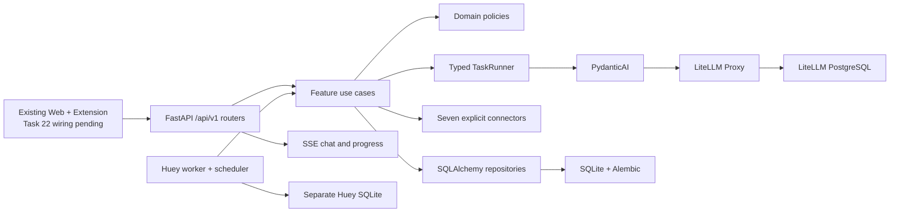

<div align="center">

# 🦀 OpenBiliClaw

**A local-first, evidence-based personalized content discovery agent**

[中文](README.md) · [Architecture](docs/architecture.md) · [Docker](docs/docker-deployment.md) · [Changelog](docs/changelog.md)

</div>

## Current status

OpenBiliClaw is undergoing an intentionally incompatible vNext backend cutover. The
authoritative runtime is now the feature-oriented `/api/v1`, an independent Huey
worker, a SQLite application database, PydanticAI typed tasks, and LiteLLM Proxy.
Legacy APIs, stored-data formats, and feature CLI commands are unsupported.

The existing static Web and browser-extension assets are still mounted by the API,
but **they are not a usable vNext product interface until Task 22 rewires the shared
API client**. Validate the backend through OpenAPI, protected APIs, and the
operational CLI; do not rely on legacy settings or flows rendered by those assets.

The retained journey is source connection and bootstrap → activity evidence →
revisioned profile → discovery feed → feedback → chat → local favorites and watch
later. Built-in sources are Bilibili, Xiaohongshu, Douyin, YouTube, X, Zhihu, and
Reddit. Each connector exposes only capabilities it actually supports.

## Architecture



OpenBiliClaw owns task semantics, typed contracts, domain rules, and persistence.
LiteLLM owns provider credentials, routing, fallback, cooldown, network retry,
budgets, and caching.

## Installation

### Docker (recommended)

Docker Compose v2 is required:

```bash
git clone https://github.com/whiteguo233/OpenBiliClaw.git
cd OpenBiliClaw
MODE=docker bash scripts/install.sh
```

The installer atomically generates PostgreSQL, LiteLLM, source-encryption, and API
bearer secrets in a mode-`0600` `.env`; reruns reuse existing values. Compose starts
`api`, `worker`, `litellm`, and LiteLLM PostgreSQL. The API and worker use the exact
same application database and Huey queue paths.

After startup, configure providers in `http://127.0.0.1:4000/ui` and create these
stable aliases:

- `obc-interactive`
- `obc-analysis`
- `obc-embedding`

### Source / uv

A source install must use a user-supplied LiteLLM proxy. The installer securely
prompts for its base URL and key; key input is hidden and neither value is printed:

```bash
MODE=local bash scripts/install.sh
```

Automation may pre-set `OPENBILICLAW_LITELLM_BASE_URL` and
`OPENBILICLAW_LITELLM_API_KEY`. Runtime settings are persisted in `.env`, the
application database is `data/vnext/openbiliclaw.db`, and the queue is
`data/vnext/huey.db`. The fixed order is dependencies → private environment →
Alembic migration → API + worker → `doctor` → public and bearer-protected checks.

The installer does not implement a provider editor or run product initialization.
Use `/api/v1/sources` and `/api/v1/onboarding` for source connection and bootstrap.

## Operational CLI

```text
openbiliclaw serve
openbiliclaw worker
openbiliclaw doctor
openbiliclaw eval
openbiliclaw db migrate
openbiliclaw db backup <destination>
```

API readiness is `GET /api/v1/system/readiness`. Except for the first-run onboarding
exception, business endpoints require a bearer token matching
`OPENBILICLAW_ACCESS_TOKEN` in `.env`. Never put the token in logs, screenshots, or
Git.

## Development checks

```bash
uv sync --frozen
uv run ruff format --check src tests
uv run ruff check src tests
uv run mypy src
uv run pytest
```

New core modules require strict MyPy, Ruff complexity ≤ 12, import contracts, and
unit tests that need no live provider. Old data directories remain untouched as a
manual archive; vNext uses a fresh database and performs no compatibility import.

## Documentation

- [vNext API](docs/modules/vnext-api.md)
- [vNext AI](docs/modules/vnext-ai.md)
- [vNext sources](docs/modules/vnext-sources.md)
- [Use cases and jobs](docs/modules/vnext-use-cases-jobs.md)
- [Installer contract](docs/agent-install.md)
- [Manual E2E](docs/manual-e2e.md)

## License

[MIT](LICENSE)
