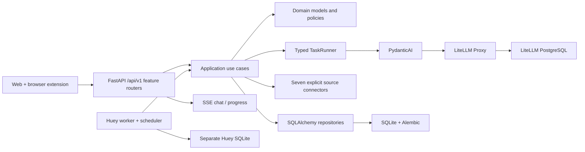

# OpenBiliClaw

**A local-first, evidence-based personalized content discovery agent**

[中文](README.md) · [Installation](docs/installation.md) · [Architecture](docs/architecture.md) · [Changelog](docs/changelog.md)

OpenBiliClaw normalizes supported signals from Bilibili, Xiaohongshu, Douyin, YouTube, X, Zhihu, and Reddit into evidence, maintains a traceable user profile, and builds a discovery feed from it. The retained journey includes source connection and bootstrap, profile, feed, feedback, chat, local favorites, and watch later.

v0.4 is an intentionally incompatible rebuild: the vNext backend is the sole authoritative runtime.
Only `/api/v1` and the fresh vNext database are supported. Web and the extension use OpenAPI
generated clients, generic `/api/v1/source-tasks`, and authenticated SSE for TaskRunner chat and
progress. Old APIs and data are not migrated; old files remain untouched as a manual archive.
Use `openbiliclaw doctor` for deployment diagnostics.

The authoritative runtime is the FastAPI/Huey vNext backend. The existing Web and
extension use OpenAPI-generated clients, authenticated SSE, and the generic
`/api/v1/source-tasks` contract. Operational diagnosis uses `openbiliclaw doctor`,
and interactive AI uses the shared typed `TaskRunner`.

## Architecture



OpenBiliClaw owns task semantics, typed contracts, domain rules, and product data. LiteLLM owns provider credentials, routing, fallback, retries, budgets, and caching. Browser work uses only the generic `/api/v1/source-tasks` claim/complete contract; unsupported source capabilities are not emulated.

## Installation

Docker Compose v2 is recommended:

```bash
git clone https://github.com/whiteguo233/OpenBiliClaw.git
cd OpenBiliClaw
MODE=docker bash scripts/install.sh
```

After installation:

1. Open `http://127.0.0.1:4000/ui` and create the `obc-interactive`, `obc-analysis`, and `obc-embedding` aliases in LiteLLM Admin.
2. Open `http://127.0.0.1:8420/setup/` to connect sources and run the first bootstrap.
3. Use `http://127.0.0.1:8420/web/`, or build and load the browser extension.

A source install requires a user-supplied LiteLLM Proxy:

```bash
MODE=local bash scripts/install.sh
```

See [Installation](docs/installation.md) and [Docker deployment](docs/docker-deployment.md). Installer-generated secrets live in a private `.env`; never commit them or include them in logs or screenshots.

## Operational CLI

```text
openbiliclaw serve
openbiliclaw worker
openbiliclaw doctor
openbiliclaw eval
openbiliclaw db migrate
openbiliclaw db backup <destination>
```

Product workflows are available through Web, the extension, and `/api/v1`; the CLI has no legacy feature-command aliases.

## Development checks

```bash
uv sync --frozen
uv run ruff format --check src tests
uv run ruff check src tests
uv run mypy src
uv run lint-imports
uv run pytest --cov=openbiliclaw
```

Extension checks:

```bash
cd extension
npm run api:check
npm run typecheck
npm test
npm run build
npm run build:firefox
```

New core modules require strict MyPy, Ruff complexity ≤ 12, import contracts, and tests that need no live provider.

## Documentation

- [Documentation index](docs/index.md)
- [System specification](docs/spec.md)
- [Platform source integration](docs/platform-source-integration.md)
- [Manual E2E](docs/manual-e2e.md)
- [Architecture rebuild plan](docs/superpowers/plans/2026-07-17-backend-first-architecture-rebuild.md)

## License

[MIT](LICENSE)
