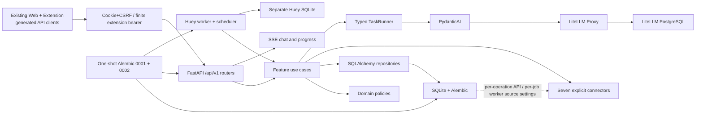

<div align="center">

# 🦀 OpenBiliClaw

**A local-first, evidence-based personalized content discovery agent**

[中文](README.md) · [Architecture](docs/architecture.md) · [Docker](docs/docker-deployment.md) · [Changelog](docs/changelog.md)

</div>

## Current status

OpenBiliClaw is undergoing an intentionally incompatible vNext backend cutover. The
authoritative runtime is now the feature-oriented `/api/v1`, an independent Huey
worker, a SQLite application database, PydanticAI typed tasks, and LiteLLM Proxy.
Legacy APIs, stored-data formats, and feature CLI commands are unsupported.

The existing static Web and browser extension now consume vNext through deterministic
OpenAPI-generated clients. Web uses same-origin HttpOnly cookies plus CSRF, the
extension exchanges its device key for a finite bearer, and both consume SSE with
authenticated `fetch` streams.

The retained journey is source connection and bootstrap → activity evidence →
revisioned profile → discovery feed → feedback → chat → local favorites and watch
later. Built-in sources are Bilibili, Xiaohongshu, Douyin, YouTube, X, Zhihu, and
Reddit. Each connector exposes only capabilities it actually supports.

## Architecture



OpenBiliClaw owns task semantics, typed contracts, domain rules, and persistence.
LiteLLM owns provider credentials, routing, fallback, cooldown, network retry,
budgets, and caching.
Browser-assisted work uses only the authoritative `/api/v1/source-tasks`
claim/complete contract; chat streams SSE directly through the shared `TaskRunner`.
Web and popup expose onboarding, sources, the evidence profile, feed, feedback, chat,
local favorites/watch later, all nested settings, and LiteLLM alias health. The extension
uses one generic dispatcher for declared browser operations and normalizes passive capture
to `ActivityEvent`. Provider editors, native saves/saved sync, delight, self-update, and
desktop controls are no longer part of the active product graph.

## Installation

### Docker (recommended)

Docker Compose v2 is required:

```bash
git clone https://github.com/whiteguo233/OpenBiliClaw.git
cd OpenBiliClaw
MODE=docker bash scripts/install.sh
```

The installer atomically generates PostgreSQL, LiteLLM, source-encryption, API bearer,
and an independent Web/extension session-signing secret in a mode-`0600` `.env`; reruns
reuse existing values without printing them. Compose runs a
one-shot `migrate` service before `api`, `worker`, `litellm`, and LiteLLM PostgreSQL;
a migration failure blocks both runtime processes. API and worker only verify schema
head and use the exact same application database and Huey queue paths. Installation
succeeds only after `migrate` exits zero and both API and worker report `healthy`; the
worker probe verifies PID 1, schema head, and a writable Huey SQLite transaction.

After startup, configure providers in `http://127.0.0.1:4000/ui` and create these
stable aliases:

- `obc-interactive`
- `obc-analysis`
- `obc-embedding`

### Source / uv

A source install must use a user-supplied LiteLLM proxy. The installer securely
prompts for its base URL and key; key input is hidden and neither value is printed:

```bash
MODE=local bash scripts/install.sh
```

Automation may pre-set `OPENBILICLAW_LITELLM_BASE_URL` and
`OPENBILICLAW_LITELLM_API_KEY`. Runtime settings are persisted in `.env`, the
application database is `data/vnext/openbiliclaw.db`, and the queue is
`data/vnext/huey.db`. The fixed order is dependencies → private environment →
verified stop of the previous managed pair → Alembic migration → API + worker →
`doctor` → public and bearer-protected checks. A stable cross-process guard at the
checkout root is acquired before the inner lifecycle lock and installer metadata are
sampled. The two layers serialize the complete transaction and share one exact lease:
installer UUID, canonical root, monotonic generation, and anchor UUID/device/inode.
The lease is revalidated after waiting, before work, on generation advance, and at exit,
under one non-resettable deadline. The guard validates every complete history record and
commits each generation as an identical pending/committed pair; only generation-zero
initialization or an exact same-root/instance/anchor one-generation gap is recovered.
Metadata replacement stays bound to its temporary FD, is `fchmod`ed only through that FD
on POSIX, and verifies the inode before and after publication; uncertain failure artifacts
are retained rather than pathname-unlinked. POSIX opens `data/vnext` one held component at a
time and rejects symlinks, junctions, inode replacement, and multiply linked anchors.
Crash-orphan recovery on POSIX requires private regular-file, owner, mode, single-link,
and pathname checks. Under the stable root guard, native Windows accepts only a
non-reparse, regular, single-link orphan whose held and pathname identities match; it
does not use Unix `fchmod` or claim equivalent ACL assurance. The binding is reread after lock
acquisition and before release. A missing/replaced bound lock path, or a
symlink/junction ancestor, fails closed. A
copied `.env` rebinds managed root/DB/Huey/instance fields while preserving secrets
and the external LiteLLM connection.
Stop/failure cleanup retains the ownership-bound dead state until the next
ownership-checked publication, and non-regular state such as a directory or FIFO
fails closed. A migration-failure rerun may rebind only the same instance's process state
that is exactly one generation behind before stopping that exact pair. Windows logs use
no-delete-share, reparse-aware native handles. Docker rechecks API and worker Compose health
after protected readiness.

The trust boundary is the canonical checkout root resolved and held at startup. It covers
normal concurrency, crash recovery, managed-leaf replacement, and symlink/junction
redirection. It does not claim to resist a malicious same-UID process replacing the whole
checkout root, or all Windows coordination objects together.

The installer does not implement a provider editor or run product initialization.
Use `/api/v1/sources` and `/api/v1/onboarding` for source connection and bootstrap.

## Operational CLI

```text
openbiliclaw serve
openbiliclaw worker
openbiliclaw doctor
openbiliclaw eval
openbiliclaw db migrate
openbiliclaw db backup <destination>
```

`db backup` fully syncs a held payload. macOS uses only `.backup-00.tmp` through
`.backup-31.tmp`, holds the selected slot with an exclusive lock, and publishes directly
from the held FD with no-replace `fclonefileat`. It then verifies exact bytes and SQLite
integrity; complete success zeroes and syncs only the held FD for safe slot reuse, while
nonzero failures remain bounded with no pathname cleanup. Linux keeps the unlinked
`O_TMPFILE` + `linkat(AT_EMPTY_PATH)` path.
If a Linux capability policy rejects `AT_EMPTY_PATH`, a fallback through
`/proc/self/fd` is allowed only after it is verified against the held inode, using
`AT_SYMLINK_FOLLOW`. The destination parent pathname is rebound to its held directory
FD after directory sync. Windows or a platform without a safe publication primitive
fails before destination reservation. Verified private source hard-link staging
directories are not pathname-deleted after use; at most 32 are retained per candidate
parent. Operators must remove `.obc-backup-source-*` only when no backup is running once
that cap is reached.

API readiness is `GET /api/v1/system/readiness`. Except for the first-run onboarding
exception, business endpoints require a bearer token matching
`OPENBILICLAW_ACCESS_TOKEN` in `.env`. Never put the token in logs, screenshots, or
Git.

## Development checks

```bash
uv sync --frozen
uv run ruff format --check src tests
uv run ruff check src tests
uv run mypy src
uv run pytest
```

New core modules require strict MyPy, Ruff complexity ≤ 12, import contracts, and
unit tests that need no live provider. Old data directories remain untouched as a
manual archive; vNext uses a fresh database and performs no compatibility import.

## Documentation

- [vNext API](docs/modules/vnext-api.md)
- [vNext AI](docs/modules/vnext-ai.md)
- [vNext sources](docs/modules/vnext-sources.md)
- [Use cases and jobs](docs/modules/vnext-use-cases-jobs.md)
- [Installer contract](docs/agent-install.md)
- [Manual E2E](docs/manual-e2e.md)

## License

[MIT](LICENSE)
