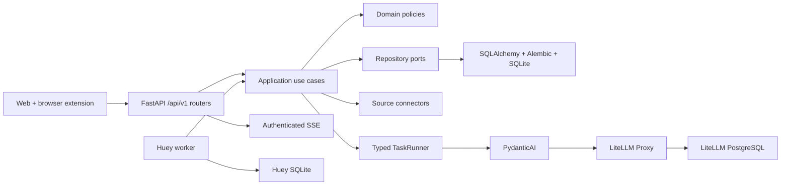

# OpenBiliClaw vNext 架构

vNext 是唯一权威运行面。旧 provider 路由、JSON 画像、平台专用任务 API、运行时循环、账号写入和桌面应用不再存在；历史实现通过 Git 历史查阅。

## 分层

```text
Web / extension / operational CLI
        │ generated client / typed command
        ▼
FastAPI /api/v1 feature routers + authenticated SSE
        │
        ▼
application use cases
        ├── activity ─► profile
        ├── sources ──► content ─► feed / interaction
        ├── library
        └── chat
        │ ports
        ▼
domain models and deterministic policies

infrastructure adapters
        ├── SQLAlchemy repositories + Alembic ─► SQLite application DB
        ├── Huey worker/scheduler ──────────────► separate SQLite queue
        ├── PydanticAI TaskRunner ──────────────► LiteLLM ─► providers
        ├── embedding service ──────────────────► LiteLLM
        ├── explicit seven-source connectors
        └── credential encryption / browser task transport
```

Dependency direction is inward: feature/domain code does not import FastAPI, SQLAlchemy, Huey, provider SDKs, or platform transports. Infrastructure implements feature ports. The app factory only builds dependencies, installs middleware, registers routers, performs startup gates, and closes resources.

## Runtime composition



Docker Compose runs one-shot `migrate`, then `api`, `worker`, `litellm`, and `litellm-postgres`. API and worker share `data/vnext/openbiliclaw.db`; Huey uses `data/vnext/huey.db`. Source installs run API and worker locally and require an external LiteLLM.

Installer-managed secret 与来源加密密钥只通过私密 environment 注入；provider 凭据只存在于
LiteLLM，不能进入 feature settings、应用数据库或 generated client response。

## Domain and persistence

- All imported account activity, passive browser events, feedback, chat learning, and profile edits normalize to `ActivityEvent`, then `ProfileSignal`.
- One revisioned `ProfileSnapshot` stores narrative, facets, confidence, weights, and evidence IDs. AI proposes a typed `ProfileDelta`; deterministic rules validate and apply it transactionally.
- Discovery uses `ContentItem`, `CandidateAssessment`, `FeedEntry`, and `Interaction`. LLM output never controls workflow or persistence.
- Favorites and watch later are predefined local collections over `CollectionItem`; no source account is mutated.
- Business job state lives in `job_runs`. Huey result state is transport-only.

Alembic is the schema authority. Runtime startup verifies exact head and never creates schema implicitly. Old data paths are read-only manual archives and have no importer.

## AI boundary

Application code knows only:

- `obc-interactive` for chat and low-latency tasks;
- `obc-analysis` for profile, keyword, assessment, and explanation tasks;
- `obc-embedding` for the OpenAI-compatible embedding service.

`TaskRunner` validates typed input/output, applies semantic retry and usage/timeout limits, and records provider-neutral run metadata. LiteLLM owns credentials, deployments, routing, fallback, network retry, cooldown, rate limiting, budgets, and cache. Static instructions remain separate from dynamic profile/content data.

## Jobs

Only four durable job types are registered: `source_sync`, `profile_projection`, `feed_replenishment`, and `cleanup`. Priorities are interactive, user-triggered, and scheduled maintenance. Chat runs directly through the shared runner and SSE. Job handlers are idempotent and use application transactions for visible status and feature effects.

## Sources and browser tasks

The composition root explicitly registers Bilibili, Xiaohongshu, Douyin, YouTube, X, Zhihu, and Reddit. Each connector publishes a strict manifest and only real capabilities. Raw HTTP, CLI, SDK, and DOM responses stay inside the platform package.

Browser-assisted work uses typed `GET /api/v1/source-tasks/claim` and `POST /api/v1/source-tasks/{task_id}/complete`. Requests have deadlines and leases; late or mismatched completion is rejected. The extension uses one generic dispatcher.

## Public interfaces

FastAPI exposes only `/api/v1` groups for auth, system, settings, onboarding, sources, source tasks, events, profile, feed, interactions, library, chat, and jobs. JSON errors use `{ "error": { "code", "message" } }`. Web uses HttpOnly cookie plus CSRF; the extension exchanges a device key for a finite bearer. Both consume SSE with authenticated `fetch` streams.

See the [system specification](spec.md) and [module index](index.md) for detailed contracts.
